# HDLRuby Tutorial for Software People

In this tutorial, you will learn the basics about the description of digital circuits using HDLRuby from the software point of view. In detail you will learn:

 1. [What is HDLRuby and how to use its framework.](#1-what-is-hdlruby-and-how-to-use-its-framework)

 2. [How to represent a circuit.](#2-how-to-represent-a-circuit-in-hdlruby)

 3. [How to describe an algorithm to be implemented by a circuit.](#3-how-to-describe-an-algorithm-to-be-implemented-by-a-circuit)

 4. [How to add parallelism to your algorithms.](#4-how-to-add-parallelism-to-your-algorithms)

Then, the following section will introduce advanced concepts about hardware design and HDLruby:

 5. [Toward lower level hardware design: the processes.](#5-toward-lower-level-hardware-design-the-processes)

 6. [Not enough? What about genericity, object orientation, metaprogramming, and reflection?](#6-not-enough-what-about-genericity-object-orientation-metaprogramming-and-reflection)

Within these topics, you will also have an explanation of how the following high-level concepts can be used in HDLRuby:

 * Object-oriented programming

 * Reflection

 * Genericity

 * Metaprogramming

But, before going further, here are a few...

## Prerequisites

Since this tutorial is aimed at software people, it is assumed you have a good understanding of programming and the relevant tools (e.g., editor, compiler). However, it is not assumed that you have any knowledge about digital hardware design. Otherwise, knowing the Ruby programming language is recommended but not mandatory.

To use HDLRuby the following software is required:

 * A distribution of the Ruby language.

 * A text editor. If you like syntax highlighting or other fancy features, please choose one supporting Ruby. 

 * A command line interface (e.g., command prompt, terminal emulator.)

The following software is also recommended:

 * A wave viewer supporting *vcd* files (e.g., [GTKWave](https://gtkwave.sourceforge.net/).)

## 1. What is HDLRuby and how to use its framework

HDLRuby is a hardware description language (HDL) based on the Ruby programming language. It is implemented as a Ruby library so that, by construction, any Ruby code can be used and executed within the HDLRuby description.

Before going further, let us briefly explain what is a [HDL](#11-what-is-a-hardware-description-language-hdl). Then, more details will be given about how to [install HDLRuby](#12-installing-hdlruby) and how to [use it](#13-using-hdlruby).

### 1.1. What is a hardware description language (HDL)

A hardware description language (HDL) is a formal language that is used for describing electronic circuits. Such circuits can be divided into two categories: analog circuits and digital circuits. While there exists HDL for describing the first category of circuits, a large majority of them only support the second one. Hence, in practice, HDL usually means language for describing digital circuits only. Among the multiple HDL, two became de-facto standards: Verilog HDL and VHDL.

Nowadays, there exist powerful software tools that can automatically produce circuits from HDL descriptions. However, like in software, there may be errors in the descriptions, or they may be sub-optimal, so that the final circuit does not work, or does not meet some constraints. Unfortunately, in hardware, producing a circuit is very time-consuming and expensive so contrary to software, errors or low-performance results must be avoided as early as possible. This is why it is common in hardware to **simulate** your circuit description before starting to produce it. In other words, while in software it is common to perform the following loop:

<p align="center">
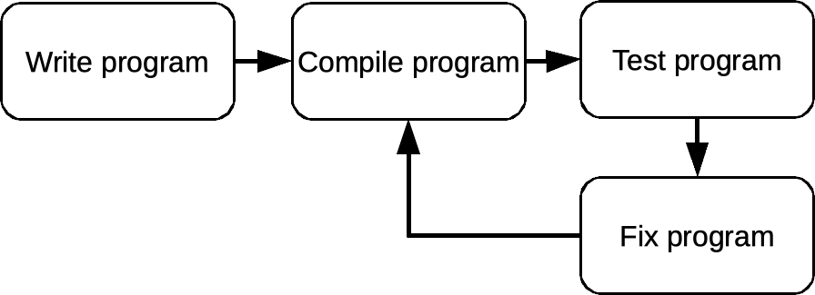
</p>


In hardware, the design loop is more like as follows:

<p align="center">
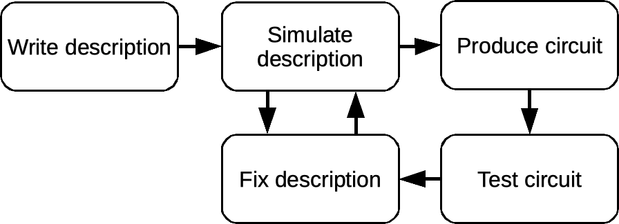
</p>


At first, an HDL has the same look and feel compared to classical programming languages like C or Java: it includes expressions, control statements, and kinds of variables. However, the underlining model of computation is quite different, especially because circuits are inherently parallel devices. This will be explained progressively during this tutorial, but for now, it is enough to remember the following:

 * HDL are used for describing digital circuits and the most common ones are Verilog HDL and VHDL.

 * Using software tools called synthesis tools, you can produce real digital circuits from HDL description. But before that, you will need to simulate your description.

 * An HDL looks like a common programming language but does not work the same.


#### And what about HDLRuby?

Well, HDLRuby is an HDL for describing digital circuits like Verilog HDL or VHDL but aiming at being more flexible and productive than them by relying on many concepts inherited from the Ruby programming language. So everything said earlier about HDL applies to HDLRuby, but we try to make it much easier for the designers.


### 1.2. Installing HDLRuby

HDLRuby is distributed as a RubyGems package. It can therefore be installed using the following command:

```bash
gem install HDLRuby
```

If everything is OK, the following should be displayed:

```
Fetching HDLRuby-<version>.gem
Building native extensions. This could take a while...
Successfully installed HDLRuby-<version>
Parsing documentation for HDLRuby-<version>
Done installing documentation for HDLRuby after <x> seconds.
```

The `version` number should be the latest version of HDLRuby.

You can then check if HDLRuby is properly installed by using the following command:

```bash
hdrcc --version
```

And the result should be:

```
<version>
```

If the resulting `version` number does not match the install number, there may have been a problem somewhere. It may be a good idea to close the terminal or command prompt and try again the command in a new one.


### 1.3. Using HDLRuby

Up to now, we said that HDLRuby is a language, it is in truth a complete framework for designing and simulating digital circuits. It includes several compilers, simulators, and libraries that are all accessible through a single command: `hdrcc`.

Basically, `hdrcc` is used as follows:

```bash
hdrcc <options> <input file> <output directory>
```

Where `options` specifies the action to be performed, `input file` specifies the input HDLRuby file, and `output directory` specifies the directory where the command results will be saved. As a general rule, when an input file is specified, an output directory must also be specified.

Several actions are possible using `hdrcc`, the main ones being the followings:

 * Simulate a circuit description:  
 
 ```bash
 hdrcc --sim <input file> <output directory>
 ```

 * Generate the equivalent Verilog HDL code:  

 ```bash
 hdrcc --verilog <input file> <output directory>
 ```  

 This second action is necessary if you want to produce a real circuit since HDLRuby is not yet supported by synthesis tools.

__Note__: VHDL generation is also possible using the following command.  

 ```bash
 hdrcc --vhdl <input file> <output directory>
 ```

And that's it! For details about all the actions that can be performed, how to write an input file, and what kind of output can be produced, let us see the remaining of the tutorial.


## 2. How to represent a circuit in HDLRuby

In this section we will see:

 * [How to declare a circuit.](#21-declaring-a-circuit)

 * [How to reuse a circuit already declared.](#22-how-to-reuse-a-circuit-already-declared)

### 2.1. Declaring a circuit

In HDLRuby as well as in other HDL, a circuit is viewed as a box that communicates with its environment with ports. The following charts illustrate such a view with a circuit including 5 ports:

<p align="center">
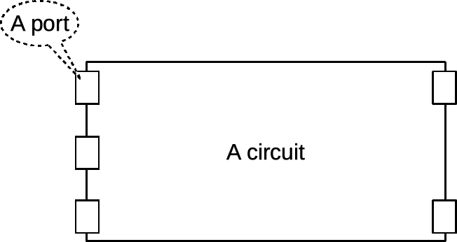
</p>


Ports are not simple entry points though, because they also have a data type and a direction that can be one of the following:

 * `input`: such a port can be used for transmitting data from the outside of the circuit to its inside.

 * `output`: such a port can only be used for transmitting data from the inside of the circuit to its outside.

 * `inout`: such a port can only be used both as an `input` port and as an `output` port. Due to physical limitations, these ports are difficult to use though, and will therefore be ignored until the [advance part of this tutorial](#tri-state).


#### That's all very well, but when do I write HDLRuby code?

With that in mind, declaring a circuit consists in specifying its name and its ports. In HDLRuby this is done as follows:

```ruby
system :my_circuit do
   input :clk, :rst
   [16].input :addr
   input :ce
   [8].input  :data_in
   [8].output :data_out
end
```

So please write the code above in a file called (for example) `my_circuit.rb`, and let us explain its meaning.

 * In the first line, the keyword `system` indicates a new circuit will be described. Its name is given after the colon, `my_circuit` here.

 * The `do` &rarr; `end` block contains the description of the circuit. Here, only the ports are specified as follows:

   - On the second line, `input` specifies two one-bit input ports named respectively `clk` and `rst`.

   - The third line specifies a 16-bit input port named `addr`.

   - The fourth line specifies a one-bit input port named `ce`.

   - The fifth line specifies an eight-bit input port named `data_in`.

   - The sixth line specifies an 8-bit output port named `data_out`.


And here is a diagram of this circuit:

<p align="center">
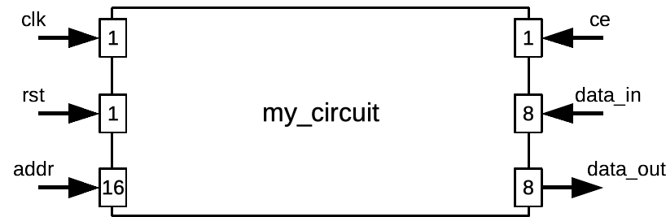
</p>


To sum up things:

 * `system` declares a new circuit description.

 * `input` specifies one or several input ports, `output` one or several output ports, and `inout` one or several input-output ports.

 * The data type of the port is given before the direction as follows:  

 ```ruby
 <type>.input <list of ports names>
 ```  

 We will give later more details about data types in HDLRuby.


Now let us see if your circuit description is all right with the following command:

```bash
hdrcc my_circuit.rb work
```

...Nothing happened? Great, that means that there was no syntax error in your description. Now let us try something else:

```bash
hdrcc --hdr my_circuit.rb work
```

If everything was OK, a file named `my_circuit.rb` should have appeared in the `work` directory. Open it with a text editor, its content should be the following:

```ruby
system :"__:T:0:1" do
   bit. input :clk
   bit.input :rst
   bit[15..0].input :addr
   bit.input :ce
   bit[7..0].input :data_in
   bit[7..0].output :data_out

end
```

It looks somewhat similar to the code you have just written. This is because it is the internal representation (IR) of your circuit in HDLRuby. You can see that the name of the circuit changed to some weird character string and that the data types also changed. The weird string is for avoiding name clashes, so you do not need to be concerned about it. The data types are low-level representations of the same data types that were used in the initial file. Still, this low-level representation is very close to the original one, but that will be less and less the case as the features are added to the circuit.

Now, out of curiosity, how will look the equivalent Verilog HDL code? For checking that just type the following command:

```bash
hdrcc --verilog my_circuit.rb work
```

If everything was OK, a file named `my_circuit.v` should have appeared in the `work` directory. Open it with a text editor, its content should be the following:

```verilog
`timescale 1ps/1ps

module _v0_1( _v1_clk, _v2_rst, _v3_addr, _v4_data_in, _v5_data_out );
   input _v1_clk;
   input _v2_rst;
   input [15:0] _v3_addr;
   input _v4_ce;
   input [7:0] _v5_data_in;
   output [7:0] _v6_data_out;


endmodule
```

The syntax looks indeed a little bit different from HDLRuby, but you should be able to recognize the description of the circuit. The name of the ports is different though, this is because HDLRuby supports any Unicode character for names and to avoid compatibility problems, it recreates the names when generating Verilog. Still, an effort is made to keep the original name, e.g., `clk` became `_v1_clk`. But, just for the fun, please replace `:addr` in the HDLRuby file with `:☺` and regenerate Verilog HDL from it... It works! And the result is:

```verilog
`timescale 1ps/1ps

module _v0_1( _v1_clk, _v2_rst, _v3_, _v4_data_in, _v5_data_out );
   input _v1_clk;
   input _v2_rst;
   input [15:0] _v3_;
   input _v4_ce;
   input [7:0] _v5_data_in;
   output [7:0] _v6_data_out;


endmodule
```

Unfortunately, there is no more smiling face. This is because Verilog HDL only supports a subset of ASCII for names. But even without smiling, the code is valid because the HDLRuby framework did recreate Verilog HDL-friendly names.


### 2.2. How to reuse a circuit already declared

Like with functions in software, a circuit is often used as part of one or several larger circuits. Contrary to the software, however, the circuit must be physically copied for being reused. This copy is called an *instance* and the act of copying an *instantiation*. In HDLRuby, an instantiation is done as follows:

```ruby
<circuit name>(:<copy name>)
```

For example, if you what to use copies of the previously defined circuit `my_circuit` in a new circuit called `another_circuit` you can do as follows:

```ruby
system :another_circuit do
   input :clk, :rst
   [16].input :addr
   input :ce0, :ce1
   [8].input :data_in
   [8].output :data_out

   my_circuit(:my_circuit0)
   my_circuit(:my_circuit1)
end
```

For testing purposes, write the code above into another file called `another_circuit.rb`, and try to generate Verilog HDL from it:

```bash
hdrcc --verilog another_circuit.rb work
```

Oh, it appears that something went wrong since the following should have appeared:

```
another_circuit.rb:8:in `block in <main>': undefined HDLRuby construct, local variable or method `my_circuit'.
```

This error message indicates that `my_circuit` is not known. This is because, like the Ruby language, in HDLRuby you must specify the files you are using. Please add as the first line in your `another_circuit.rb` file the following code:

```ruby
require_relative "my_circuit.rb"
```

Then retry the Verilog HDL generation command:

```bash
hdrcc --verilog another_circuit.rb work
```

Three new files should have appeared in the `work` directory: `_v10_5.v`, `_v8_4.v` and `another_circuit.v`. If you open the third file you should see:

```verilog
`timescale 1ps/1ps

module _v0_3( _v1_clk, _v2_rst, _v3_addr, _v4_ce0, _v5_ce1, _v6_data_in, _v7_data_out );
   input _v1_clk;
   input _v2_rst;
   input [15:0] _v3_addr;
   input _v4_ce0;
   input _v5_ce1;
   input [7:0] _v6_data_in;
   output [7:0] _v7_data_out;

   _v8_4 _v9_my_circuit0();
   _v10_5 _v11_my_circuit1();

endmodule
```

Again, we can see similarities between the resulting Verilog HDL code and the original HDLRuby one. Still, what are `_v8_4` and `_v10_5`? You can see them by opening the corresponding files `_v8_4.rb` and `_v10_5.rb`, those are the descriptions of `my_circuit` in Verilog HDL.

> __But why two of them?__ I would like to answer that this is because of a limitation of Verilog HDL, but this is not the case. It is because HDLRuby's instantiation mechanism is very different from the Verilog HDL (and the VHDL) one, so for the moment, and only for easing the coding work of the HDLRuby compiler, one description of `my_circuit` is generated per instance.


Copying a circuit is easy, but it achieves no purpose if the copied circuit is not in a relationship with its environment. It is where the ports become useful: they are the communication points between a circuit and its outside world. Concretely, to interact with a circuit, its ports must be connected to something that will interact with them. How this interaction work is a story for the other sections of this tutorial. For now, let us focus on connections: in HDLRuby this is done using the assignment operator `<=` as follows:

 * For an input port of the current circuit:  
 ```ruby
 <something> <= <input port>
 ```

 * For an output port of the current circuit:
 ```ruby
 <output port> <= <something>
 ```

Many things can be connected to a port, but right now, we only know about ports, so let us do the connection in `another_circuit` with them. So here is the new code of `another_circuit.rb`, please modify the file accordingly:

```ruby
require_relative "my_circuit.rb"

system :another_circuit do
   input :clk, :rst
   [16].input :addr
   input :ce0, :ce1
   [8].input :data_in
   [8].output :data_out

   my_circuit(:my_circuit0)
   my_circuit(:my_circuit1)

   my_circuit0.clk  <= clk
   my_circuit0.rst  <= rst
   my_circuit0.addr <= addr
   my_circuit0.ce   <= ce0
   my_circuit0.data_in <= data_in

   my_circuit1.clk  <= clk
   my_circuit1.rst  <= rst
   my_circuit1.addr <= addr
   my_circuit1.ce   <= ce1
   my_circuit1.data_in <= data_in
end
```

If you are familiar with object-oriented or structured software programming, this code should be straightforward: the dot `.` operator is used to access a sub-element and in this case the ports of `my_circuit0` and `my_circuit1`. For example, the first connection line (line 10) connects the `clk` port of `another_circuit` to the one of `my_circuit0`, so that any data that goes through the former port will also go through the latter.

Now, the `data_out` ports are still not connected. It may be tempting to connect them like `data_in` as follows:

```ruby
  data_out <= circuit0.data_out
  data_out <= circuit1.data_out
```

This will work indeed, but not the way you may think: in hardware, you cannot normally connect to one port several different objects. It is like assigning several values at the **same** time to a single variable. What will happen in HDLRuby, is that only the last statement will be kept, i.e., port `data_out` of `circuit0` will not be connected.

With such kind of cases, what we often want to do is to connect to `data_out` some computation result between the output of `circuit0` and `circuit1`. This is the opportunity to see another kind of construct that can be connected to a port: an expression. Like in software, an expression represents an arithmetic and logic computation. For example, let us consider the following connection:

```ruby
  data_out <= my_circuit0.data_out + my_circuit1.data_out
```

With this connection, the sum of the outputs `my_circuit0` and `my_circuit1` is transmitted through the output port `data_out` of `another_circuit`.

> __But when is this computation performed?__ This is a very good question: while in software, programs are executed one instruction after the other, in hardware, there is no such thing as the execution of instructions. The expression connected to `data_out` is not an instruction at all! It is a description of a part of the circuit that specifies that an adder (a circuit that does addition) must be instantiated with the output ports `data_out` of `my_circuit0` and `my_circuit1` connected to its inputs and its output connected to the output port `data_out` of `another_circuit`. The following figures show the schematic of this hardware portion:


<p align="center">
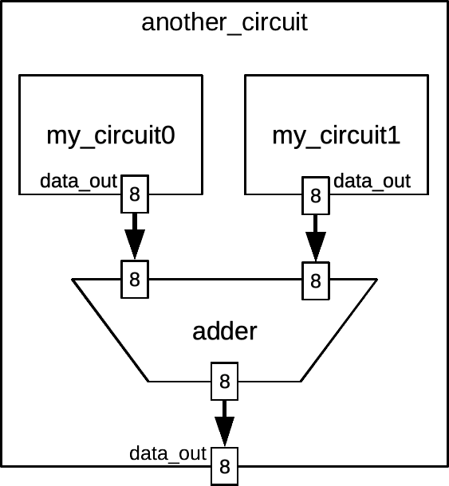
</p>
   

> __So, when this expression is executed?__ It is continuously executed, i.e., as soon as one of the outputs `data_out` of `my_circuit0` or `my_circuit1` changes, so does the output `data_out` of `another_circuit`.

For trying this new circuit, please update the code of `another_circuit.rb` as follows:

```ruby
require_relative "my_circuit.rb"

system :another_circuit do
   input :clk, :rst
   [16].input :addr
   input :ce0, :ce1
   [8].input :data_in
   [8].output :data_out

   my_circuit(:my_circuit0)
   my_circuit(:my_circuit1)

   my_circuit0.clk  <= clk
   my_circuit0.rst  <= rst
   my_circuit0.addr <= addr
   my_circuit0.ce   <= ce0
   my_circuit0.data_in <= data_in

   my_circuit1.clk  <= clk
   my_circuit1.rst  <= rst
   my_circuit1.addr <= addr
   my_circuit1.ce   <= ce1
   my_circuit1.data_in <= data_in

   data_out <= my_circuit0.data_out + my_circuit1.data_out
end
```

Then, let us generate again Verilog HDL from it:

```bash
hdrcc --verilog another_circuit.rb work
```

Oh! If you get the following error message:

```
another_circuit.rb:15:in `block in <main>': undefined method `addr' for #<HDLRuby::High::Namespace:<whatever number>>
```

Do not forget to replace the smiling face with `addr` in `my_circuit.rb`.

When the compile succeeds (no error message), two new files appear in `work`, namely `_v20_4.v` and `_v23_5.v`. Those are the new descriptions of `my_circuit`, they did not change, but since new hardware has been added their name changed. For the interesting part, let us open again `another_circuit.v`, the result should be as follows:

```verilog
`timescale 1ps/1ps

module _v0_3( _v1_clk, _v2_rst, _v3_addr, _v4_ce0, _v5_ce1, _v6_data_in, _v7_data_out );
   input _v1_clk;
   input _v2_rst;
   input [15:0] _v3_addr;
   input _v4_ce0;
   input _v5_ce1;
   input [7:0] _v6_data_in;
   output [7:0] _v7_data_out;
   wire _v8_0;
   wire _v9_1;
   wire [15:0] _v10_2;
   wire _v11_3;
   wire [7:0] _v12_4;
   wire _v13_5;
   wire _v14_6;
   wire [15:0] _v15_7;
   wire _v16_8;
   wire [7:0] _v17_9;
   wire [7:0] _v18_10;
   wire [7:0] _v19_11;

      _v20_4 _v21_my_circuit0(._v1_clk(_v8_0),._v2_rst(_v9_1),._v3_addr(_v10_2),._v22_ce(_v11_3),._v6_data_in(_v12_4),._v7_data_out(_v18_10));
   _v23_5 _v24_my_circuit1(._v1_clk(_v13_5),._v2_rst(_v14_6),._v3_addr(_v15_7),._v22_ce(_v16_8),._v6_data_in(_v17_9),._v7_data_out(_v19_11));
   assign _v8_0 = _v1_clk;

   assign _v9_1 = _v2_rst;

   assign _v10_2 = _v3_addr;

   assign _v11_3 = _v4_ce0;

   assign _v12_4 = _v6_data_in;

   assign _v13_5 = _v1_clk;

   assign _v14_6 = _v2_rst;

   assign _v15_7 = _v3_addr;

   assign _v16_8 = _v5_ce1;

   assign _v17_9 = _v6_data_in;

   assign _v7_data_out = (_v18_10 + _v19_11);


endmodule
```

The code is starting to get complicated and seemed to be much different from the HDLRuby description than before. This is because this time, real syntactic limitations of Verilog HDL compared to HDLRuby have to be bypassed. Here, the limitation is that while in HDLRuby, ports can be connected wherever we want, in Verilog HDL, this must be done only while instantiating.

In fact, in HDLRuby too you can do the connection while instantiating, this is even recommended for better readability of the code. There are two ways to do so: by position (like for the arguments of a function call) or by name. Let us see both by editing again `another_circuit.rb`: please just replace both instantiation lines with the followings:

```ruby
my_circuit(:my_circuit0).(clk,rst,addr,ce0,data_in,data_out)
my_circuit(:my_circuit1).(clk: clk, rst: rst, addr: addr, ce: ce1,
                          data_in: data_in, data_out: data_out)
```

The instantiation for `my_circuit0` does the connection by position, that is to say, that each port given between the second parenthesis is connected in the order of declaration of in ports of `my_circuit.rb`. For `my_circuit1P` the connection is done by name: then syntax `<name>: <something>` connects ports named `name` of the instance of `my_circuit` to `something`. For example `clk: clk` connects port `clk` of `my_circuit0` to port `clk` of `another_circuit`.


#### That's all for this section!

---

Now you know:

 * How to declare a new circuit with its name and ports in HDLRuby.

 * How to check it with hdrcc.

 * How to convert it to Verilog HDL.

 * How to reuse it into another circuit.

 * And even, how to describe the computation of some expressions and connect them to an output port.

But you still do not know: how to describe more complex computations, e.g., controls, and how to simulate a circuit. Let us start slowly (from the software person's point of view) with how to describe an algorithm the simple way in HDLRuby.


## 3. How to describe an algorithm to be implemented by a circuit

In this section we will see:

 * [How to handle values in a circuit.](#31-how-to-handle-values-in-a-circuit)

 * [How to describe an algorithm that a circuit can implement.](#32-how-to-describe-an-algorithm-that-a-circuit-can-implement)

### 3.1. How to handle values in a circuit

In software, handling values looks straightforward enough: they are computed with expressions and stored in variables. In hardware it is slightly different since two kinds of components handle values: the wires and the storage components: 

 * The wires are abstractions of physical wires or sets of wires that transmit data to the hardware component they are connected to. A wire cannot hold a value: if a component drives a value to a wire, this wire takes this value, and it will last as soon as this drive stops.

 * The storage components are abstractions of registers or memories that can hold values. Depending on how they are described, the value they hold can be changed on specific events like the rising edge of a clock. Hence, the storages component are closer to the software variable than the wires are.

With HDL like Verilog HDL, there is a real distinction between wires and storage components. However, with other HDL like VHDL, or here with HDLRuby, both are abstracted by a single concept: the signal. Specifically, when a signal is only driven on a given event, it becomes a storage element, otherwise, it will remain a wire.

__Note__: one may ask what about the `variable` construct in VHDL: those are syntactic intermediates used for simplifying the descriptions. HDLRuby also supports such a `variable` construct, but those are simply the variables of the Ruby language. Therefore, these variables can hold not only values but any Ruby or HDLRuby constructs.

In HDLRuby, there are three kinds of signals: the input ports, the output ports, the inout ports, and the inner signals. The first three kinds of signals have already been described in the section about declaring a [circuit](#circuit-declare). At that time they were called ports because it is what such constructs are called in common HDL. However, in HDLRuby there is no distinction at all between ports and signals, hence from now on, we will use the term `signal` in general, and the term `port` when we only want to refer to the interface of a circuit. The inner signals can be used inside a circuit and are usually used as an intermediate for internal computations. They are declared like the ports, but using `inner` instead of `input`, `output`, or `inout`. For example, the following code declares a module named `a_circuit` with two 1-bit inputs, one 8-bit output, and one 4-bit inner signal.

```ruby
system(:a_circuit) do
   input :u, :v
   [8].output :z

   [4].inner :sig
end
```

__Note__: the inner signals as well as the ports can be declared anywhere within the body of a module. It is however recommended to declare the ports at the beginning, and the inner signal when relevant, e.g., it may not be a good idea to declare an inner signal at the beginning of a circuit description if it is only used at the end.

#### What about the data types?

For now, we only used positive integer values, e.g., `[8].inner` declares an 8-bit positive integer. To tell the truth, `[8]` is not the designation of the 8-bit positive integer data type, but a syntactic sugar that stands for: `bit[8]`. As a general rule, in HDLRuby, the designation of a data type is as follows:

```ruby
<base>[<range>]
```

Where `base` is another data type and `range` describes the range of indexes used for accessing its elements individually. In addition, there are three root data types used for building all the other ones:

 * `bit`: for boolean, or 1-bit unsigned values, i.e., the only possible values are 0 and 1.

 * `signed`: for 1-bit signed values in 2's complement, i.e., the only possible values are 0 and -1.

 * `float`: for 1-bit floating point values, but, __WARNING__: this data type is not supported yet!

For example, a 32-bit input signed integer signal and an inner array of eight 24-bit integers are declared respectively as follows:

```ruby
signed[32].input :sig
bit[24][8].inner :ar
```

> Unfortunately, the following is not valid:  
  `[24][8].inner :ar`  
  This is because it conflicts with other constructs in the language. 

When the code above is declared, you can access one element of array `ar` using the brackets like before, e.g., its first element is `ar[0]`, its second one `ar[1]`, and so on. But you can also access its last element as follows: `ar[-1]`, its element before the last one as follows `ar[-2]`, and so on. Moreover, since an integer is just an array of bits, it is possible to access its bits individually in the same way. For example, accessing the first bit of the last element of ar can be done as follows: `ar[-1][0]`.

But compared to the software you can do even more than that: you can also access to sub-range of elements of a signal. For example, assigning bits from index 4 to 27 of signal `sig` to element 1 of array `ar` can be written as follows using *range*:

```ruby
ar[1] <= sig[27..4]
```

A range is noted as follows: `<start value>..<end value>`, and indicates respectively the value of the first and the last indexes. Convenient, is not it? But wait... Why `27..4` and not `4..27`?

#### Let us talk about endianness.

If you are familiar with hardware or with low-level software, you may be aware of this topic. There are two possible ways for reading a value or the content of an array: from the most significant bit or index to the least significant one (big-endian) and the opposite (little-endian). Since big-endian is more natural for reading numbers it is the default mode in HDL, including HDLRuby. However, for an array, software programming usually does the opposite. In HDLRuby, using little-endian instead of big-endian is declared by using a negative number for the size instead of a positive one.

As a general rule, code will be much easier to understand if integer values are big-endian and the array accesses little-endian. That is to say that the following declaration is the best for `ar`:

```ruby
bit[24][-8].inner :ar
```

> One last thing: it is also possible to set the numbering of each bit of a signal using again a *range* instead of an integer indicating the size. For example, with the following declaration, `a` is an 8-bit big-endian integer with its bits numbered from 0 to 7, and `b` is a 9-bit little-endian integer with its bits numbered from 1 to 9:  
  `[7..0].inner :a`  
  `[1..9].inner :b`

So now you know about basic types in HDLRuby, but what happens when we make operations between signals of different types?

#### About casting and auto-casting

First, you can convert the type of a signal using the cast operator `as`. For example, in the following code, the result of a 16-bit unsigned addition is performed between the 8-bit signal `x` converted to 16-bit and the 16-bit signal `y`:

```ruby
[8].inner :x
[16].inner :y, :z

<some code>

z <= x.as(bit[16]) + y
```

However, if you do not use the cast operator, HDLRuby will do it automatically for you and cast the operands to the largest of their types. That is to say that for the following code the result is identical to the previous one:

```ruby
[8].inner :x
[16].inner :y, :z

<some code>

z <= x + y
```

This rule means that for the following code, `z` will have the result of an 8-bit addition since both operands `x` and `y` are 8-bit:

```ruby
[8].inner :x, :y
[16].inner :z

<some code>

z <= x + y
```

If you want a 16-bit addition, you must add a cast to at least one of the operands, e.g.:

```ruby
[8].inner :x, :y
[16].inner :z

<some code>

z <= x.as(bit[16]) + y
```

---

These explanations about data types may have been not so fun, be we should better get over with them first so that now we can start the real fun with actual "programming"...

__Note__: "Programming" is put between quotes because this is not programming since there is no program, but instead, a description of a physical circuit.


### 3.2. How to describe an algorithm that a circuit can implement

So now you know how to declare a circuit, use it, connect it, and declare variable-like constructs that are called signals. We will see later that signals are definitive **not** software variables, but let us go on with the illusion for a little while and see how you can describe an algorithm in HDLRuby. As a side note, the features described in this section are unique to HDLRuby so do not expect to be able to do the same with Verilog HDL or VHDL.

With software languages, when you want to describe an algorithm you use assignments but also control statements like `if`, `for`, or `while`. If you know higher-level languages like `Java` or `Ruby` you may also use design patterns like `iterators` (or `enumerators`). You can do the same in HDLRuby with constructs called *sequencers*. At first glance, a sequencer can be seen as the description of a hardware component implementing a software algorithm. Hence, a sequencer may look like a processor, but there are differences:

 * It is not possible to change the algorithm implemented by a sequencer (you cannot "load" a new program).

 * A sequencer starts execution according to a given start signal, and from there advances execution at each cycle of a given clock.

 * You have control of the algorithm at the clock cycle level, and incidentally, a sequencer is much more efficient than a processor executing a program.


This section will explain the following about sequencers:

 * [How to declare and control a sequencer.](#321-how-to-declare-and-control-a-sequencer)

 * [How to write a structured programming algorithm in a sequencer.](#322-how-to-write-a-structured-programming-algorithm-in-a-sequencer)

 * [How to write and use a sequencer function.](#323-how-to-write-and-use-a-sequencer-function)

 * [How to use enumerators in a sequencer.](#324-how-to-use-enumerators-in-a-sequencer)

 * [What happens when there are several sequencers?](#325-what-happens-when-there-are-several-sequencers)


#### 3.2.1 How to declare and control a sequencer

As said in the previous section, a sequencer advances execution according to a clock and starts execution according to a start signal. A clock is a single-bit signal that alternates from 0 to 1, and it is the transition from 0 to 1, or from 1 to 0 of this signal that will make a sequencer progress execution. Let us see two examples of sequencers to understand better:

```ruby
system :the_counter do
   inner :clk, :start

   sequencer(clk,start) do
   end
end
```

In the code above, a module containing one sequencer is described. The sequencer is controlled by the start signal `start` and clock signal `clk`, which means that:

 * it will advance execution every time `clk` switches from 0 to 1 - we call such an event a *positive edge* of `clk`;
 
 * it will start when signal `start` switches from 1 to 0 - we call such an event a *negative edge* of `start`.

Why a positive edge for `clk` and a negative one for `start`? It does not matter much, and you can specify the edges you want using the `posedge` and `negedge` methods. For example, the following sequencer advances execution on a negative edge of `clk` and starts on a positive edge of `start`:

```ruby
sequencer(clk.negedge,start.posedge) { }
```

__Note__: the curly brackets used here are equivalent to the `do` and `end` keywords we used until now.

> __WARNING__: there is a caveat though, since a sequencer advances execution according to a clock signal, it will not be able to start properly unless the start signal is strictly slower than the clock.

But now, what will this sequencer do? ... Nothing right now since its body is empty. So let us start small and make it count the number of a few clock cycles:

```ruby
system :the_counter do
   inner :clk, :start
   [8].inner :count

   sequencer(clk,start) do
      count <= 0
      step
      count <= count + 1
      step
      count <= count + 1
      step
      count <= count + 1
   end
end
```

The first line of the body of the counter looks like the connection of ports we described [previously](#circuit-use). However it is inside the body of a sequencer and will therefore be *executed* by it, that is to say, before this statement is executed, `count` may not be 0. More generally:

 * Every assignment statement outside sequencers (and later processes) is a connection: the signal will *always* and *continuously* have the value that is assigned to them.

 * The other assignment statements, e.g., the ones inside a sequencer, are called *transmission* in HDLRuby and happen only when "executed."

In our example, the count is set to 0 when the sequencer starts execution. But before that, no one knows the value of count: it is said to be *undefined*.

Just after this initial line, there is the `step` keyword. There we go from the software world to the hardware one: this keyword indicates that the sequencer ends execution here until the next clock cycle. Looking at the subsequent line you may understand why we waited: this line increases the value of `count` by one, i.e., the sequencer counted one clock cycle. Again, a `step` is inserted, and `count` is increased, and so on, so that this is indeed the code of a sequencer that counts the clock cycles. However the code ends after 3 clock cycles, and like with software, when the code of a sequencer is over, it stops execution.

This may look abstract, so let us try to simulate this circuit. For that purpose, write the code into a file named `the_counter.rb` (for example) and try the following command that will simulate the circuit:

```bash
hdrcc --sim the_counter.rb the_counter
```

If everything was all right the following text will appear:

```
__:T:0:::2: 000
```

It indicates that a signal named `__: T:0:::2` has been initialized to 0 (000), and that's all... Why is that, and why only that? First, this signal with a strange name has been generated by HDLRuby for the internal processing of the sequencer and is required to be initialized to 0. So, ok, the simulation did some initialization, but it did not seem to do any execution. This is because we did not give any description of the physical environment of the circuit, and especially, we did not say that the clock and the start signal need to change value. For describing the behavior of the environment of a circuit, we use a construct called in HDLRuby the *timed process*. They are somewhat close to sequencers but are not controlled by a clock signal but by physical time. So let us add the following code just after the sequencer (but still inside the module `the_counter`:

```ruby
   timed do
      clk <= 0
      start <= 0
      !10.ns
      clk <= 1
      !10.ns
      clk <= 0
      start <= 1
      !10.ns
      clk <= 1
      !10.ns
      clk <= 0
      start <= 0
      !10.ns
      clk <= 1
      !10.ns
      clk <= 0
      !10.ns
      clk <= 1
      !10.ns
      clk <= 0
      !10.ns
      clk <= 1
      !10.ns
      clk <= 0
      !10.ns
      clk <= 1
      !10.ns
      clk <= 0
      !10.ns
      clk <= 1
      !10.ns
   end
```

Sorry, this code is a little bit long... Did you add it to the file `the_counter.rb`? now please try again the simulation command:

```bash
hdrcc --sim the_counter.rb the_counter
```

You should have the following result:

```
__:T:0:::2: 000
__:T:0::clk: 0
__:T:0::start: 0
# 10000ps
__:T:0::clk: 1
__:T:0:::1: 000
# 20000ps
__:T:0::clk: 0
__:T:0::start: 1
# 30000ps
__:T:0::clk: 1
__:T:0:::2: 001
# 40000ps
__:T:0::start: 0
__:T:0::clk: 0
# 50000ps
__:T:0::clk: 1
__:T:0:::1: 001
__:T:0::count: 00000000
__:T:0:::2: 010
# 60000ps
__:T:0::clk: 0
# 70000ps
__:T:0::clk: 1
__:T:0:::1: 010
__:T:0::count: 00000001
__:T:0:::2: 011
# 80000ps
__:T:0::clk: 0
# 90000ps
__:T:0::clk: 1
__:T:0:::1: 011
__:T:0::count: 00000010
__:T:0:::2: 100
# 100000ps
__:T:0::clk: 0
# 110000ps
__:T:0::clk: 1
__:T:0:::1: 100
__:T:0::count: 00000011
__:T:0:::2: 101
# 120000ps
__:T:0::clk: 0
# 130000ps
__:T:0::clk: 1
__:T:0:::1: 101
__:T:0:::2: 000
# 140000ps
```

If you look at the last line of the simulation result you should have `# 140000ps`, which means that final the simulation time was 140000 picoseconds (140 nanoseconds). If you look at the result in totality, you will see an alternation of signal names followed by a value in binary (e.g., `__:T:0::clk: 1` means that the `clk` signal is 1) and an indication of the time of the simulation. The names look indeed messy, but please only focus on their last parts: that will be the names of the signals you defined in your HDLRuby file. You will also notice some signals that you did not declare (e.g., `__:T:0:::1` and `__:T:0:::2`, but those are only signals generated by HDLRuby.

Now, let us see what happened, and what was the meaning of the `timed` construct we added. As explained before, `timed` constructs are like sequencers, but controlled by physical time instead of a clock signal. Inside, you can put assignments but also statements that advance the time. For instance: `!10.ns` is a statement that advances time by 10 nanoseconds (i.e., 10000 picoseconds). Hence, with such a construct you can declare that a signal will take a given value at a given time. For this example, it is enough to tell how the `clk` and `start` signal change over time to make the sequencer run by itself. Hence, the `clk` signal is made to switch from 0 to 1 then from 1 to 0 every 10 nanoseconds, which simulates a 50 MHz clock, and the start signal is set to 1 and then to 0 so that the sequencer starts execution. The first thing it does is set `counter` to 0, and then the following cycles this counter is increased until its execution completes. Even when the sequencer completes execution, the simulation goes on though, until the timed process also completes.

> __WARNING__: in HDLRuby, everything is synthesizable, i.e., it can be turned into a real circuit, **apart** from the timed processes. These constructs are only there for simulating the physical environment of a circuit.

#### Ugh! The simulation result is ugly!

Indeed, the text output of the simulator is hard to read, and therefore we highly recommend generating a graphical one using the following command:

```bash
hdrcc --sim --vcd the_counter.rb the_counter
```

The new option `--vcd` makes the simulator produce a *Value Change Dump* file (VCD) that can be visualized graphically by many HW design tools. If you do not have any such tool you can get [GTKWave](https://gtkwave.sourceforge.net/) which is under GNU General Public License v2.0.

The resulting vcd file can be found in the `the_counter` directory with the name `hruby_simulator.vcd`. If you open it and select the `clk`, `start`, and `counter` signals you will see something like the following picture:

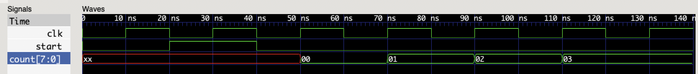

Such a graph is called a time chart and displays the evolution of signals with time on the X-axis. You can see that `clk` is indeed alternating from 0 to 1, and that `start` is set to 1 for one clock cycle only. After this later signal becomes 0 again, the sequencer starts. This can be verified by looking at the value of `counter`: at first, it is undefined, that it is set to 0, then increased by 1 at each clock cycle until it reaches 3.

---

So now, you know:
 
 * How to describe an algorithm in HDLRuby.

 * How to simulate it.

 * How to display a cool graph showing the simulation results (maybe?)

Hum, the algorithm part is quite limited, and the timed processes seem to be real pains to write. So let us see how to do better in the following section.


#### 3.2.2. How to write a structured programming algorithm in a sequencer

Now, when we speak about algorithms, we often think about software constructs like `if` for conditional executions and `for` for loops. Unfortunately, in HW design this is usually not that simple at all... But for the HDLRuby sequencers, it is indeed that simple: all these control statements are supported without any limitation. The only thing you have to be careful about is their name: to avoid confusion with the Ruby language, their names are all prefixed with an `s` (for *sequencer*), e.g, you have to use `sif` for doing an *if*.

In detail here is a list of the control statements you can use within a sequencer:

 * `sif(<condition>) <block>`: executes `block` if `condition` is true (i.e., different from 0).

 - `selsif(<condition>) <block>`: executes `block` if the previous `sif` and `selsif` conditions are false and if the current `condition` is true.

 * `selse <block>`: executes `block` if the conditions of the previous `sif` and `selsif` are false (i.e., equals 0). It is also used for giving the default block for the `scase` statements (see below).

 * `scase(<choice>)`: initializes a multiple case statement.

 * `swhen(<value>) <block>`: executes block if `value` is equal to the `choice` of the previous `scase` statement.

 * `sloop <block>`: loops infinitely repeating the execution of `block` (yes, like Ruby, if you want to do an infinite loop, do it explicitly, not with constructs like `while(true)`... even if you can).

 * `swhile(<condition>) <block>`: repeats the execution of `block` as long as `condition` is true.

 * `sfor(<enumerable>) <block>`: executes `block` on each element of `enumerable `.

 * `sbreak`: ends the current loop (even if it is a `sloop`).

 * `scontinue`: ends the current iteration.

> __IMPORTANT__: each control statement requires one clock cycle for each branch they perform, independently of what their block contains. For example, in the following code, the value of `y` will be set one cycle after `x` is set to 0, and one cycle before `z` is set to 1.

```ruby
x <= 0
sif(~x) { y <= 2 }
z <= 1
```

Let us see the details about these constructs with a few examples. First, let us make a circuit that computes the factorial of an input value when asked for:

```ruby
system :fact do
   input :clk, :start, :req
   [5].input :data_in
   output :ack
   [32].output :data_out

   [4].inner :val
   [24].inner :res

   sequencer(clk,start) do
      sloop do
         ack <= 0
         swhile(req != 1)
         val <= data_in
         res <= 1
         swhile(val>1) do
             res <= res*val
             val <= val - 1
         end
         data_out <= res
         ack <= 1
      end
   end
end
```

The code is more complex that what we have seen up to now, so let us study it progressively:

 * The circuit is named `fact` (for factorial).
 
 * It has four inputs:

   - `clk` and `start`: the signals that controls the execution of the sequencer (nothing new here).

   - `req`: the signal that will ask for a factorial computation (*req* stands for require).

   - `data_in`: the signal that will provide the input value. It is a 4-bit unsigned integer.

 * It has two outputs:

   - `ack`: the signal that will tell that the current computation of factorial is over. Such a signal is necessary for the environment to know if the output result is valid or not since the computation time of a factorial depends on the input value.

   - `data_out`: the signal that will hold the computation result. It is a 24-bit unsigned integer, much larger than the input, but we are computing factorials here! (This is not enough yet: 15! equals 1307674368000 which requires 41 bits... But 24-bit was the largest that could fit in the picture of the time chart that is shown after.)

 * The sequencer includes an infinite loop (`sloop`) so that it does not stop after one computation. Within this loop:

   - It first sets `ack` to 0 to tell that currently, its output is not valid (no computation is done yet).

   - Then it waits for a request, i.e., it waits for that signal `req` is 1. This loop (`swhile(req != 1)`) does not have any block to execute, it will therefore loop without doing anything.

   - When `req` becomes 1, it loads the input value into an internal temporary signal (`val`) and initializes the computed value (`res`) to one.
   
   - Finally, it loops by multiplying `res` by `val` and decreasing `val` until 1 is reached before assigning the computation result to `data_out` and setting `ack` to 1 for telling the computation is over.

#### Does it work?

Now let us simulate this circuit. For that, you now know that we must describe the environment using a timed process. But this time, let us do this properly  by putting the description of the environment in a different module to separate the circuit description from the simulation: please write in a file named `fact.rb` the code of module `fact`, and then the following code:

```ruby
system :fact_bench do
   inner :clk, :start, :req, :ack
   [4].inner :x
   [24].inner :z

   fact(:factI).(clk,start,req,x,ack,z)

   def clk!
       clk <= 0
       !10.ns
       clk <= 1
       !10.ns
   end

   timed do
      start <= 0
      !10.ns
      clk!
      start <= 1
      req   <= 0
      clk!
      start <= 0
      repeat(2) do
          clk!
      end
      req   <= 1
      x     <= 10
      clk!
      req   <= 0
      repeat(20) do
          clk!
      end
   end
end
```

This module introduces the `repeat` construct. It can be used within a timed process only and have the following syntax: 

```ruby
repeat(<number>) <block>
```

It executes the `block` `number` times with the number of iterations as an argument.

__WARNING__: the repeat construct cannot be used outside a timed process. Inside a sequencer, you can use instead `swhile` or `sfor`.

> There seems to be another new kind of command in the timed process: `clk!`. This is not a command though, but it is a Ruby function defined just before with the `def` block. If you are not familiar with Ruby, `def` is used for defining a new function (actually a method), also, it is not necessary to put parenthesis when calling a function. Hence, `clk!` is simply the call of this previously defined function (in Ruby, function names can terminate with characters like `!` or `?`). If you look at the body of this function, you will see not plain Ruby code, but again HDLRuby code:

```Ruby
clk <= 0
!10.ns
clk <= 1
!10.ns
```

> __IMPORTANT__: as said when presenting HDLRuby, this language is implemented on top of the Ruby language, and is fully compatible with it. For instance, you can write any Ruby code within HDLRuby constructs (e.g., `def`), and you can write HDLRuby code within Ruby constructs. However, there is an important difference: Ruby code is executed at compile time (i.e., when hdrcc runs) and does not produce any hardware, whereas HDLRuby code is the description of the hardware that will be produced and will be then executed either through simulation or after production physically.
  Then, what calling `clk!` do is paste the HDLRuby code in place. Here it is used to shorten the code: instead of each time setting the clock to 0, advancing time, then setting it to 1 again, writing `clk!` is enough to obtain the same result.  
  It is from this capability to mix Ruby and HDLRuby that comes the *meta programmability* of HDLRuby.

Finally, when you simulate with the following command:

```bash
hdrcc --sim --vcd fact.rb fact
```

You should obtain the following kind of resulting VCD file:

  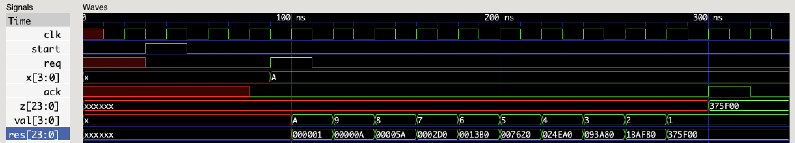


#### But in structured programming, it is better to use local variables!

Indeed, in the factorial program, signals `val` and `res` are only used within the sequencer, so why declare them outside it? The code would be more clear if they were declared more locally, i.e., *inside* it, and even better, inside its main loop. So let us modify it as follows:

```ruby
system :fact do
   input :clk, :start, :req
   [5].input :data_in
   output :ack
   [32].output :data_out

   sequencer(clk,start) do
      sloop do
         [4].inner :val
         [24].inner :res

         ack <= 0
         swhile(req != 1)
         val <= data_in
         res <= 1
         swhile(val>1) do
             res <= res*val
             val <= val - 1
         end
         data_out <= res
         ack <= 1
      end
   end
end
```

You can simulate it again, and you should obtain exactly the same result. However, if you try to access `res` or `val` outside the main loop, then an error will be raised.


#### Now about `sfor`

With a for statement you may expect something like C with the definition of an index, its initialization, and its increment. However, the `sfor` of HDLRuby is simpler: it only takes as argument an enumerable object and will iterate on each of its elements. An enumerable object is any Ruby enumerable object as well as any signal. For example, the following circuit outputs bit by bit the content of a 32-bit input value:

```ruby
system :serializer do
   input :clk, :start, :req
   [32].input :data_in
   output :tx, :data_out

   sequencer(clk,start) do
      tx <= 0
      data_out <= 0
      sloop do
         sif(req) do
            tx <= 1
            sfor(data_in) do |b|
               data_out <= b
            end
            tx <= 0
            data_out <= 0
         end
      end
   end
end
```

This circuit takes as input `data_in` and sends its content bit by bit to `data_out` when `req` is set to 1. In detail, it first indicates the beginning of the transmission by setting `tx` to 1, then from the next clock cycle will send one bit of `data_in` per clock cycle. When the transmission is over, it sets tx to 0 again. There are a few more details to unwrap:

 * By default both `tx` and `data_out` are set to 0, this is done at the beginning of the sequencer but also just after the `sfor`.

 * `tx` is set to 1 just before the `sfor` loop, i.e., one cycle before the actual transmission. As said in the description of the [control statements](#sequencer-structured), each of them requires one clock cycle before branching.

> This for loop could also have been implemented using an index as follows:

```ruby
   sfor(0..31) do |i|
      data_out <= data_in[i]
   end
```

> However, the advantage of the first version of the code is that it is still valid when the data type of `data_in` is changed whereas the second version must be rewritten to adjust the range of the index.

If you want, you can try this serializer, you need to add a module representing the environment. For example:

```ruby
system :serializer_bench do
   inner :clk, :start, :req, :tx
   [8].inner :x
   inner :z

   serializer(:serializerI).(clk,start,req,x,tx,z)

   def clk!
       clk <= 0
       !10.ns
       clk <= 1
       !10.ns
   end

      timed do
      start <= 0
      !10.ns
      clk!
      start <= 1
      req   <= 0
      clk!
      start <= 0
      repeat(2) do
          clk!
      end
      req   <= 1
      x     <= _hAB
      clk!
      req   <= 0
      repeat(16) do
          clk!
      end
   end
end
```

> There is a new notation: `_hAB`, this is used for representing fixed bit-width hexadecimal. Since there are two digits, it is an 8-bit value. You can also use binary representations as follows: `_b10101011`.

When everything is put in a file named: `serializer.rb` and simulated as follows:

```bash
hdrcc --sim --vcd serializer.rb serializer
```

You should obtain the following time chart:

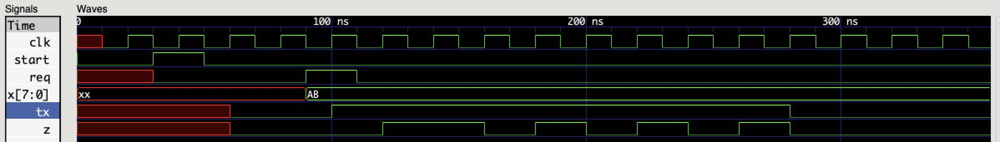


#### 3.2.3. How to write and use a sequencer function.

Why not necessarily associated with algorithmic, it is common in software to define functions for code reuse and implementation of recursive algorithms. HDLRuby also provided such kinds of functions, with all the software features, including recursion, using the construct `sdef`. Such a function is defined as follows:

```ruby
sdef :<name> do |<arguments>|
   <body>
end
```

In the code above, `name` is the name of the function, `arguments` is a list of arguments and `body` is the code of the function that can be any kind of HDLRuby sequencer code. For returning a value from a function, the `sreturn(<value>)` command is used. For example, the following describes a function computing the factorial of its argument `n`:

```ruby
sdef :fact do |n|
   sif(n>1) { sreturn(n*fact(n-1) }
   selse    { sreturn(1) }
end
```

There is a lot to unpack from this small example:

 1. Such a function can be defined outside or inside a module, but can only be called within a sequencer.

 2. The arguments of a function, here `n`, do not have any defined type: their type, and consequently the final implementation of the function, is determined by the data type of the actual arguments when the function is called. For example, in the following code, the data type of the actual argument `val` is 16-bit unsigned, hence that will be the data type of `n`.

    ```ruby
    [16].inner :val, :res

    sequencer do
       val <= 5
       res <= fact(val)
    end
    ```

 3. When a function is recursive, a stack is created to store the arguments and the sequencer states for returning at each recursion. The size of this stack is by default set to the bit width of the largest argument, e.g., for `fact` it is set for supporting 16 recursions. In case of stack overflow, i.e., there were too many recursive calls, the recursion is stopped, and the execution of the sequencer proceeds from just after the last call.

 4. The behavior of the stack can be controlled in two ways when defining a function as follows:

    ```ruby
    sdef(:<name>,<size>, proc <error_handler>) do |<arguments>|
       <body>
    end
    ```

    In the code above, `size` is the forced size of the stack, and `error_handler` is a block of code that will be executed when a stack overflow occurs. Both arguments are optional, but if the error handler is provided, then the size must also be provided. For example, the code of the factorial can be rewritten as follows for forcing the stack to support 64 recursions:

    ```ruby
    sdef(:fact,64) do |n|
       sif(n>1) { sreturn(n*fact(n-1) }
       selse    { sreturn(1) }
    end
    ```

    It can also be defined as follows to support only 8 recursions but to set a signal named `stack_overflow` to 1 when a stack overflow happens:

    ```ruby
    sdef(:fact, 8, proc { stack_overflow <= 1 }) do |n|
       sif(n>1) { sreturn(n*fact(n-1) }
       selse    { sreturn(1) }
    end
    ```

Here is a full example using the factorial:

```ruby
sdef(:fact,8,proc { stack_overflow_error <= 1 }) do |n|
    sif(n > 1) { sreturn(n*fact(n-1)) }
    selse      { sreturn(1) }
end


# Checking the fact function.
system :module_with_fact do

    inner :clk,:rst

    [16].inner :val
    [16].inner :res
    inner stack_overflow_error: 0

    sequencer(clk.posedge,rst) do
        5.stimes do |i|
            val <= i
            res <= fact(val)
        end
        hprint("stack_overflow_error=",stack_overflow_error,"\n")
    end

    timed do
        clk <= 0
        rst <= 0
        !10.ns
        clk <= 1
        !10.ns
        clk <= 0
        rst <= 1
        !10.ns
        clk <= 1
        !10.ns
        clk <= 0
        rst <= 0
        !10.ns
        clk <= 1
        repeat(500) do
            !10.ns
            clk <= ~clk
        end
    end
end
```


---

So now, you know:
 
 * How to describe fully-fledged algorithms with sequencers using conditional and control statements as well as functions, including recursive ones.

Also, if you are not familiar with languages like Ruby or Python, the `sfor` may look great compared to what C can provide. But this is just the beginning, HDLRuby can do better than that.


#### 3.2.4. How to use enumerators in a sequencer

If sometimes you program with Ruby, you may know about enumerators: they are objects used for processing iteratively several elements of objects. The HDLRuby's sequencer provides the same concept: it is possible to build hardware enumerators for any enumerable objects and they will run like Ruby's.

> We recommend before going on with this tutorial you study the Ruby enumerable and enumerators. Indeed, since the HDLRuby enumerators and enumerable objects do reproduce the functionalities of the Ruby ones, we will only point out what is specific to the hardware.

#### First, what is an enumerable?

So, enumerators iterate over enumerable, but what is it? In HDLRuby, an enumerable is either a Ruby enumerable object, an enumerator (Ruby or HDLRuby), or a signal of any type. If the signal is an array, the iteration will be over its elements, if it is a number, it will be done over its bits. For example, `0..2` is an enumerable including 0, 1, and 2 as elements, `[3,6,7]` is one including 3, 6, and 7, and the following signal `sig` includes 0, 1, 1, 0, 1, 1, 1, 0:

```ruby
[8].inner sig: _b01110110
```

#### Let us build HDLRuby enumerators.

Like Ruby builds enumerators using the `each` method and its derivates (`each_with_index` and so on,) HDLRuby uses the `seach` method to build its enumerator. For example, an enumerator over the bits of signal `sig` will be built as follows: `sig.seach`, and if you want an enumerator with index, just like Ruby: `sig.seach_with_index`, and so on. Then, an enumerator can be executed when create by providing the block that will be applied on each element like in ruby, or executed later using the `seach` method again. E.g., the following sequencer code first sums the bits of signal sig at once, then do it again later with another enumerator previously stored in the Ruby variable `another_enumerator`:

```ruby
input :clk, :start

[8].inner sig: _b01110110
[4].inner num0, :num1

sequencer(clk,start) do
   another_enum = sig.seach
   num0 <= 0
   num1 <= 0
   sig.seach {|b| num0 <= num0 + b }
   sig <= _hCD
   another_enum.seach {|b| num1 <= num1 + b }
end
```

That's all that we will explain here, the remaining is exactly like Ruby. Moreover, almost all the methods related to enumerable and enumerator have been reimplemented in HDLRuby using the prefix `s`, so please refer to the main documentation of HDLRuby about [enumerators](README.md#enumerator) for details. Let us just see a few examples: 

 * Count the number of 1 bit of a signal - again - but within an infinite loop, and with a much shorter code using the HDLRuby version of the Ruby enumerator method `reduce`:  

    ```ruby
    input :clk,:start
    [8].input :sin
    [4].output :sout
    
    sequencer(clk,start) do
       sloop do
          sout <= sin.sreduce(_h0,&:+)
       end
    end
    ```
    
   Here are a couple of remarks about this code:
   
   - You may have noticed that the initial value of reduce is set to a 4-bit 0 (`_h0`, since a hexadecimal digit is 4-bit). If this value is not set, the data type of the elements will be used for the additions, in this case, 1-bit (and a 1-bit addition is actually an exclusive or).

   - While the count of the bits is a single-line statement, it is executed like a usual sequencer loop and therefore requires 8 clock cycles for completing.

 * Fill array `ar` from input `sin` one byte per cycle then sort it and outputs its content one byte per cycle.

    ```ruby
    input :clk,:start
    [8].input :sin
    [8].output :sout
    
    bit[8][-16].inner :ar
    
    sequencer(clk,start) do
       16.stimes {|i| ar[i] <= sin }
       ar.ssort
       16.stimes {|i| sout <= ar[i] }
    end
    ```
   
   In this example, `16.stimes` generates an enumerator over the `0..7` range, and is a way to build an enumerator from an integer value.

  * Apply a 4-point FIR filter over an array obtained from input signal `sin` with 0-padding at the beginning and output the result to `sout`

    ```ruby
    input :clk,:start
    [8].input :sin
    [8].output :sout
    
    bit[8][-4].inner coefs: [_h01,_h05,_h0A,_hFE]
    bit[8][-16].inner : ar
    
    sequencer(clk,start) do
       16.stime {|i| ar[i] <= sin }
       sout <= ([_h00]*3).seach + ar.seach).seach_slice(4).sreduce(_h00) do |a,b,c,d|
          a*coefs[0] + b * coefs[1] + c * coefs[2] + d * coefs[3]
       end
    end
    ```
   
    In this example, `[_h00]*3` builds an array of three 8-bit zeros for the padding, `seach` creates the iterators over this padding. This iterator is added to one over `ar` which creates a global iterator over them all. `seach_slice` and `sreduce` work the same way their Ruby equivalent `each_slice` and `reduce` do.


#### Create your enumerator.

The method `seach` and its derivates make it possible to iterate over signals or other enumerable objects. But you can also create your enumerator that can iterate on whatever you want and the way you want. For that purpose, please use the following command:

```ruby
<variable> = senumerator(<element type>, <number of elements>) <block>
```

Where `block` is a block of sequencer code for accessing an element by index. For example, the following defines the enumerator named `enum0` enumerating over the 100 first square numbers in 32-bit:

```ruby
enum0 = senumerator(bit[32],100) {|i| i*i }
```

It is also possible to put a sequencer control statement in the access block, for example, the following enumerator accesses each bit of signal x waiting for 2 cycles between each access:

```ruby
[128].input :x
enum1 = senumerator(bit,x.width) do |i|
   step
   step
   x[i]
end
```

---

Now you know:

 * You create enumerators.

 * How to use enumerators for easily building complex algorithms.

 * How to create your enumerators.

And with that, you may be able to build sequential hardware almost as easily as software. But why bother? Simply because the performance of the resulting hardware is much better than that of software, at least in terms of energy and/or power consumption.

But this is not all: contrary to software, hardware is inherently parallel, a property that has not been considered at all yet. From now on, that will be the main topic of this tutorial. We will start slowly by studying what happens when there are several sequencers.


#### 3.2.5. What happens when there are several sequencers?


#### General considerations

You can have as many sequencers as you want in a module, and of course, you can have as many modules as you want in a circuit description. In total, all these sequencers will run independently of one another and in parallel. Furthermore, these parallel sequencers can be controlled by the same clock and start signals or by different ones.

As long as the sequencers do not access the same signals, they will not interfere with one another and what has been explained up to now is enough. However, it is common that the various parts of a circuit cooperate, and therefore exchange information, i.e., access common signals. There are two ways to handle access to the same signal from several sequencers...

#### The easy way: stick to a simple rule

There is a simple rule to follow in hardware design to avoid any trouble when accessing a signal:

> A signal can be read from anywhere at any time, but only one component (e.g., a port connection or a sequencer) can write to a given signal.

This rule is not absolute as you will see in the [hard way](#the-hard-way-arbitrating-between-writes-to-signals) to access signals, but it has the advantage of not requiring any additional hardware construct to be implemented. Hence, we do recommend following this rule as much as possible.

Let us see an example for understanding how several sequencers can interact while following this rule. First, lets us consider a sequencer that increases periodically a value and sends it to another sequencer that will count the number of bits of this value and tells the first one to proceed with the increase:

```ruby
system :bit_pong do
   inner :clk,:start
   inner :req, :ack
   [4].inner :value
   [3].inner :count

   sequencer(clk,start) do
      req <= 0
      value <= 0
      sloop do
         req <= 1
         swhile(ack != 1)
         value <= value + 1
         req <= 0
      end
   end

   sequencer(clk,start) do
      ack <= 0
      count <= 0
      sloop do
         ack <= 0
         swhile(req != 1)
         count <= value.sreduce(_h0,:+)
         ack <= 1
      end
   end

   def clk!
      !10.ns
      clk <= 1
      !10.ns
      clk <= 0
   end

   timed do
      clk   <= 0
      start <= 0
      clk!
      start <= 1
      clk!
      start <= 0
      repeat(100) { clk! }
   end

end
```

If you write this code in a file named `bit_pong.rb` and simulate it as follows:

```bash
hdrcc --sim --vcd bit_pong.rb bit_pong
```

You will obtain the following kind of time chart:

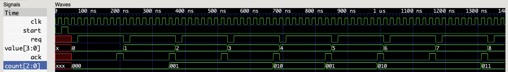

You may notice a detail that is crucial in hardware: the increase of `value` by the first sequencer starts not when `ack` becomes 1, but the next clock cycle. This is the second important rule in hardware design:

> When a signal is read in a clock-synchronized component (e.g., a sequencer), the real value is not the value of the signal at this exact instant, but the one it has a little while before. This is because hardware implementation of signals takes physical time to propagate.

With this simple rule and enough training, one can easily and efficiently implement a large range of applications. But a few cases do require several components (e.g., sequencers) to write to the same signal. For example, when a resource must be shared among several components. Let us see what can be done in such cases.


#### The hard way: arbitrating between writes to signals

The problem when several components write to the same signal is handling the cases where different values are assigned at the *same* time. This requires extra arbitration circuitry that must be described by the designer or generated by the synthesis tool. Since there is no general good way of arbitrating, the first option is the most common, but with HDLRuby's sequencer, there is an intermediate solution that does not require designing a new circuit but still lets the designer control the arbitration. It is this approach that is explained here, for the design from scratch of an arbitration please consult tutorials about advanced RTL design.

#### The hard way but not so much: shared signals

The HDLRuby sequencer supports another kind of signal called the *shared signals*. They are inner signals of a module that can be written to by any number of sequencers without causing any trouble. They are declared like any other inner signals, but using the `shared` keyword instead of `inner`. For example, a shared 8-bit signed signal named `sh` can be declared as follows:

```Ruby
signed[8].shared :sh
```

After being declared, shared signals can be used exactly like any other inner signals, but without any restriction when written within a sequencer.

#### But what about the arbitration?

By default, the arbitration when writing to a shared signal is blunt: the first declared sequencer that writes to this signal is **the only one** that changes its value. The other sequencers' writes are simply ignored. For example, in the following, code, the value of `sh` is 55, whatever the second sequencer does:

```ruby
signed[8].shared :sh

sequencer(clk,start) do
   sh <= 55
end

sequencer(clk,start) do
   100.stimes { |i| sh <= i }
end
```

This is not so useful that way, but you can control that by setting which sequencer has exclusive access using the `select` method of a shared signal. For example, in the following code, the first sequencer first writes 55 to `sh` but then gives access to the second one:

```ruby
signal[8].shared :sh

sequencer(clk,start) do
   sh <= 55
   sh.select <= 1
end

sequencer(clk,start) do
  100.stimes { |i| sh <= i }
end
```

With this code, the value of `sh` will be at each clock: 55, 1, 2, 3,...

This is simple enough, right? However, there is a limitation: only one sequencer can access to the `select` of a shared signal... Otherwise, another layer of arbitration is required and we are back to the beginning. Often, this is all right, but sometimes, complex arbitration between several sequencers and several signals makes things messy.

#### Enter the global arbiters

So, you have multiple sequencers fighting with one another for accessing several shared signals, what to do? You need a global arbiter that will decide for everyone. The sequencer library provides such a module, named `arbiter` that is instantiated like any module. However, it does not have any specific port, instead, it must be connected to the shared signals it will arbitrate. For example, an arbiter named `arb01` controlling shared signals `sh0` and `sh1` can be declared as follows:

```ruby
arbiter(:arb01).(sh0,sh1)
```

Then, when a sequencer wants to write to either `sh0` or `sh1` it must ask the right by sending 1 to the arbiter, and when the access is done, it must release that right by sending 0 so that it does not monopolize the signal. For example, the following sequencers write in turn to the 2-bit shared signal `pingpong`:

```ruby
system :pingpong do
   inner :clk, :start

   [2].shared :pingpong
   arbiter(:arb).(pingpong)

   sequencer(clk,start) do
      sloop do
        arb <= 1
        pingpong <= 1
        step
        arb <= 0
      end
   end
   
   sequencer(clk,start) do
      sloop do
        arb <= 1
        pingpong <= 2
        step
        arb <= 0
      end
   end

   timed do
      clk   <= 0
      start <= 1
      !10.ns
      clk   <= 1
      !10.ns
      clk   <= 0
      start <= 0
      !10.ns
      repeat(20) { clk <= ~clk ; !10.ns }
   end
end
```

Now, you should be used to it, so please try to simulate the code above. If you look at the VCD file in detail you will see a lot of signals but not any signal called `pingpong`. This is because shared signals hide underlining hardware that is exposed at simulation. Usually, what is relevant is the output value of the shared signal, which is called `<shared signal name>_out$<number>`. For our `pingpong` it is `pingpong_out$2`. Hence, you should get the following graph:

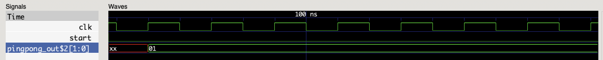

Well, this is not an interesting result: `pingpong` is always 1, what about the second sequencer? There are two reasons for this:

 * By default, an arbiter gives priority to sequencers in order of declaration.

 * When a sequencer is denied access, its write access is ignored and that's all.

Here, it happens that both sequencers always write to `pingpong` at the exact *same* time and the first one has higher priority. For instance, if the second sequencer were delayed a bit compared to the first one, it would obtain access too:

```ruby
system :pingpong do
   inner :clk, :start

   [2].shared :pingpong
   arbiter(:arb).(pingpong)

   sequencer(clk,start) do
      sloop do
        pingpong <= 1
        arb <= 1
        step
        arb <= 0
      end
   end
   
   sequencer(clk,start) do
      step
      sloop do
        pingpong <= 2
        arb <= 1
        step
        arb <= 0
      end
   end

   timed do
      clk   <= 0
      start <= 1
      !10.ns
      clk   <= 1
      !10.ns
      clk   <= 0
      start <= 0
      !10.ns
      repeat(20) { clk <= ~clk ; !10.ns }
   end
end
```

And the simulation result should be:

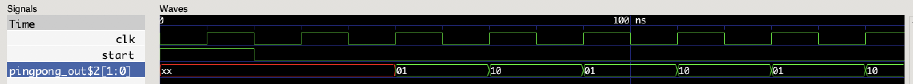

Still, it may be annoying that some writes of a sequencer can be ignored. In such a case, you can use a blocking version of the arbiter called the `monitor`. This module is used like the arbiter, but when write access is required, the sequencer will be blocked until the access is granted. Hence to avoid confusion with the arbiters' syntax, requiring access to a monitor is done by the `lock` method, and releasing it is done by the `unlock` one. For example, with the following code, the expected pingpong exchange will happen even when both sequencers try to write at the same time:

```ruby
system :pingpong do
   inner :clk, :start

   [2].shared :pingpong
   monitor(:arb).(pingpong)

   sequencer(clk,start) do
      sloop do
        pingpong <= 1
        arb.lock
        arb.unlock
      end
   end
   
   sequencer(clk,start) do
      sloop do
        pingpong <= 2
        arb.lock
        arb.unlock
      end
   end

   timed do
      clk   <= 0
      start <= 1
      !10.ns
      clk   <= 1
      !10.ns
      clk   <= 0
      start <= 0
      !10.ns
      repeat(20) { clk <= ~clk ; !10.ns }
   end
end
```

As seen in the example, since the monitors locks processes, no `step` is required, and the simulation result should be:

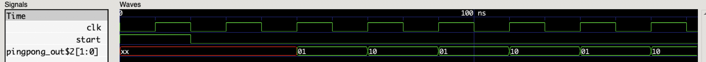

> __WARNING__: while with an arbiter it was of no importance, with a monitor the lock must be made *after* the shared signal is written, otherwise this value will be taken into account one cycle later.

By the way, why does HDLRuby provide the arbiters if the monitors do a better job? For performance reasons first: using an arbiter produces a smaller and faster circuit. Also, it is sometimes better not to block a sequencer: for example, maybe you want to write to a shared signal if possible, and if not do something else. this can be done as follows:

```ruby
sequencer(clk,start) do
   arb <= 1
   sif(sh.select == arb.cur_priority) { sh <= 2 }
   selse { <do something else> }
   arb <= 0
end
```

In the code above, the sequencer checks if it has access by comparing the shared signal selection with its priority (obtained by `arb.cur_priority`).

#### I do not like the priority rule of the arbiter / monitor

Indeed, sometimes we need to define our priority rules. This can be done when instantiating an arbiter or a monitor in two possible fashions:

 * You can provide your priority table as an array containing the declaration order of the sequencers in order of priority, e.g., for reversing the priority in our example:  

```ruby
arbiter(:arb,[1,0]).(pingpong)
```

 * You can provide your policy as a chunk of HDLRuby code whose argument is the declaration order of a sequencer and that returns true if the sequencer is granted priority. Here is an example that switches priority at each acquirement:

```ruby
inner switch: 1
arbiter(:arb) { |i| switch <= ~switch ; i == switch }.(pingpong)
```


---

Now you know:

 * That sequencers run in parallel.

 * How to synchronize them.

 * How to share resources between them.

 * How to make intricate deadlocks and how to escape them using arbiters and monitors... Just to make even more intricate ones (trust me with that).

 * And...

#### That's all for this section!

Congratulations! You know everything about describing a working circuit and using your knowledge of software design, I am sure you can already do great things.

But in hardware, you can go much more into the details for even more performance. So let us go to the more advanced parts of this tutorial.


## 4. How to add parallelism to your algorithms

In software, when you want to do parallelism you usually need specific libraries because the model of computation of software is inherently sequential. But this is not the case with the HDLRuby sequencers because:

 * [A sequencer is not a program](#41-a-sequencer-is-not-a-program)

 * [Adding parallelism is genuine](#42-parallel-control-statements-functions-and-enumerators)

### 4.1. A sequencer is not a program

We said earlier that hardware is inherently parallel and we showed that multiple sequencers run concurrently by default. However, you may want to increase parallelism within an algorithm too: after all, it is what recent processors do, so why not hardware?

To tell the truth, we lied a little when we said that the sequencers were "executing" statements in order. They do not execute anything and statements are not *instructions*. Rather, they are *instantiations* of circuits performing basic computations, and the sequencer only schedules when each circuit is to be used. For example, the following code describes two 3-value addition circuits selected respectively at the first and second clock cycles:

```ruby
sequencer(clk,start) do
   d <= a + b + c
   step
   z <= u + v + w
end
```

Now, what about the following:

```ruby
sequencer(clk,start) do
   d <= a + b + c
   z <= u + v + w
end
```

... Yes, as said early, when there is no control statement or step, the clock does not advances. That means that both adder circuits are selected at the same time and do "run" in parallel. Then what about the following:

```ruby
sequencer(clk,start) do
   d <= a + b + c
   z <= u + v + d
```

... This time, `z` requires the value of `d`, but both circuits will again be selected at the same time. However, the output of the first one is connected to the third input of the second one: since they are combinatorial, waiting a little bit is enough for obtaining the right `d` input for computing `z`.

> __WARNING__: in hardware design with HDLRuby (and with all similar languages like Verilog VHDL or VHDL,) it is assumed that a clock is slow enough for the relevant combinatorial circuits to complete computation before the next cycle. If this is not the case, the resulting circuits will not function properly. Fortunately, the synthesis frameworks usually provide tools for verifying these timings.


### 4.2. Parallel control statements, functions, and enumerators

Sequencers provide many constructs for easy control and enumeration. However, those constructs are sequential by construction. What if you would like to do the same in parallel? This is possible, but there is an important restriction:

> __WARNING__: there cannot be any loop within a parallel section of an algorithm.

#### 4.2.1. Parallel conditionals

With that being said, even without loops you can do a lot of things. First, let us see parallel conditional and case statements. We already presented the sequential versions: `sif` and `scase`. The parallel versions have the same syntax but use an `h` instead of an `s`:

 * `hif(<condition>) <block>`: executes `block` if `condition` is true (i.e., different from 0).

 - `helsif(<condition>) <block>`: executes `block` if the conditions of the previous `hif` and `helsif` are false and if the current `condition` is true.

 * `helse <block>`: executes `block` if the conditions of the previous `hif` and `helsif` are false (i.e., equals 0). It is also used for giving the default block for the `hcase` statement (see below).

 * `hcase(<choice>)`: initializes a multiple case statement.

> __WARNING__: these are parallel statements, hence their blocks **CANNOT** contain any sequential statement like `step`, `sif`, `sloop`, or even `sbreak`.

However, they have the advantage of not waiting for the next clock cycle, hence high-speed algorithms can be devised when using them. For example, the following assigns to `d` the max of signals `u`, `v`, and `w` in less than one cycle:

```ruby
   sequencer(clk,start) do
      hif(u > v) do
         hif(u > w) { d <= u }
	 helse      { d <= w }
      end
      helsif(v > w) { d <= v }
      helse         { d <= w }
      ...
   end
```

#### 4.2.2. Yes, but without loops, we are quite limited no?

There is a whole range of computations that do not require any loop: the *dataflow* computations. Indeed, more often than not, in software programs, the loops like `for` or `while` are only there for ease of design or conciseness of code, and do not have any algorithmic purpose. For example, if you want to pick up the max value of a fixed-sized array, you do not need a loop for that... Heh, we just did that in the previous section (just replace `u`, `v`, and `w` with `ar[0]`, `ar[1]`, and `ar[2]`).

Still, the code of the previous section was only for three variables, and the code was already a bit messy. Fortunately, you can use Ruby for this purpose... Do you remember? In HDLRuby, Ruby code is executed at compile time, so Ruby loops or iterators can be used to produce complex hardware descriptions cleanly. However...

> __WARNING__: Ruby code itself does not generate nor interact with hardware, for obtaining real hardware description you **must** put HDLRuby code within the Ruby loops.

Also: 

> __WARNING__: Ruby iterators **do not** apply on HDLRuby construct. But, you can convert an HDLRuby signal to a Ruby array for applying Ruby iterators on it. For that purpose, please use the `to_a` method.

Let us wrap everything we said with a sequencer selecting in parallel the largest element of an array signal of sixteen 8-bit elements:

```ruby
system :maxxer do
   inner :clk, :start

   bit[8][-8].inner ar: [ _h05, _hA3, _h54, _h2F, _h33, _hE4, _h6B, _h1C ]
   bit[8].inner :ar_max

   sequencer(clk,start) do
      ar_max <= 0
      ar.to_a.each do |e|
         hif(ar_max < e) { ar_max <= e }
      end
   end

   timed do
      clk   <= 0
      start <= 1
      !10.ns
      clk   <= 1
      !10.ns
      clk   <= 0
      start <= 0
      !10.ns
      repeat(20) { clk <= ~clk ; !10.ns }
   end
end
```

The simulation result should be:

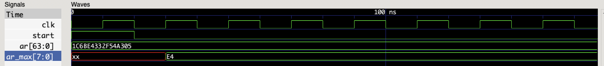

As promised, the max is obtained at the first cycle of the sequencer execution!

However, the code given below will not produce anything other than setting `ar_max` to 0, because the Ruby `max` method does not use any HDLRuby code:

```ruby
   sequencer(clk,start) do
      ar_max <= 0
      ar.to_a.max
   end
```

So, you can use `each` but not `max`... Why? Because the `max` method does the comparison between elements at HDLRuby compile time and does not generate any hardware. More generally:

> If the method iterates without any **implicit** computation, then it can be used for parallel HDLRuby description.

Yes, this is becoming confusing because it is hard to know what Ruby does when executing its methods. Unfortunately, there is nothing to help with that yet, but we hope to clarify things in future versions of HDLRuby. For now, if unsure, it is recommended to stick to the following Ruby methods:

 * `each`, `each_cons`, `each_slice`

 * `reduce` (or `inject`)

 * `zip`


#### 4.2.3. Can functions be parallel too?

As explained before, the body of a `sdef` function can contain any kind of sequencer code, hence parallel code is also possible. Yet, calling and returning from such a function are themselves sequential procedures that require several cycles to be performed. Hence, there exists a parallel version of `sdef` whose call and return as well as its body execution is fully combinatorial. It is declared as follows:

```ruby
hdef :<name> do |<arguments>|
   <body>
end
```

As you can see, the declaration is identical to the `sdef` one. However the behavior is different, and this new kind of function has the following limitations:

 1. It cannot contain any sequential code, i.e., constructs like `step`, `sif` or `sloop`.

 2. It does not support the `sreturn` constructs either, instead, it is the last value computed by the function that is returned.

 3. It cannot be recursive.

Here is an example of a parallel-compatible function counting the number of ones in the input argument:

```ruby
hdef :popcount do |n|
   n.each.reduce(_b0.as(n.type),&:+)
end
```

In the code above, it can be seen that no return is provided but instead, it will be the result of the parallel sum result that will be returned since it is the last computation of the function. Also, the data type of the sum is obtained from the argument `n` (`as(n.type)`).

---

Now you know:

 * How to introduce parallelism within a sequencer.

 * How to define a parallel-compatible function using `hdef`

But, by the way, why bother with sequential code if parallel one is faster?


#### 4.2.4. Parallel is faster, so why do sequential computations?

Why parallel dataflow computations are indeed faster than sequential ones, in theory, they also have some drawbacks.

* First, not every algorithm can be implemented by a dataflow computation. For example, the initial sequencer example that counts the clock cycles is necessarily sequential. More generally, any algorithm that has as input or output a sequence of values must be sequential. But that is not all:

    > Any algorithm that processes data of arbitrary size requires at least partly some sequential computation.

  For example, how can you process a text whose size is unknown without any sequential computation... You can say, OK, let us first look for the end of the text and then we can process it in parallel but wait... Looking for this end will require some sequential processing, e.g., looking at one character after the other if it is the end (EOF).

 * Second, parallel implementation of algorithms requires much more chip area than sequential ones. This is expensive, and there are some physical limitations with the size of a chip.

 * Third, while faster in theory, parallel implementations may end slower than sequential ones in practice. This is because, the large a combinatorial circuit is, the longer its delays are.


Now, the big question is: how do we know which part of our circuit would better be parallel?

> Unfortunately, the best answer is the designer's experience.

Indeed, some design tools can choose for yourself, but the solution they give may not match your expectations. For HDLRuby, the idea is to let the designer decide but help him with as easy to use as possible sequential and parallel constructs.


#### That's all for this section!

That was short this time because almost all have been already said in the previous sessions. But now it is time to go past the sequencers and dive into real RTL design.


## 5. Toward lower level hardware design: the processes

Why sequencers are easy to use with a software mindset, they are implemented on top of a control circuit that schedules their operations. While this circuit does not represent much overhead, you may want top-notch optimizations, or simply you may want more precise control over what hardware will be produced. It is therefore time to leave the comfort of the sequencer and study genuine hardware description constructs: the *processes*. Things will become more difficult, but here is an attempt to do it progressively:

 * [What are the processes?](#51-what-are-the-processes)

 * [What are the connection processes?](#52-what-are-the-connection-processes)
 
 * [What are the combinatorial processes?](#53-what-are-the-combinatorial-processes)

 * [What are the clocked processes?](#54-what-are-the-clocked-processes)

 * [What about the control statements in processes?](#55-what-about-the-control-statements-in-processes)

 * [How to share signals in processes?](#56-how-to-share-signals-in-processes)


### 5.1. What are the processes?

First, we must make things clear: 

> Processes in hardware has very little (nothing?) to do with any kind of software process.

In hardware, a process is a list of data flow statements that are activated (we would say *executed* if they were software instructions) on a common condition. 

> By data flow statements, we mean all the assignment statements, the `hif`, `helse`, `hcase` and `hwhen` statements, and the calls to `hdef` functions.

Depending on the activation condition, there are three kinds of processes:

 * The connection processes (in HDLRuby they are considered to be processes)

 * The combinatorial processes

 * The clocked processes

We also saw earlier the timed processes, they are indeed kinds of processes, but they do not represent hardware and are therefore not considered in this section.

We will detail these three kinds of hardware processes in further sections, but there is another property to discuss before: that is the way the data flow statements are scheduled within a process. Like with the sequencer between clock cycles, everything is parallel, but unlike it, there are two possible ways for handling dependencies:

 * Blocking assignments scheduling where the result of a statement can be used directly as input of the following statements. Such processes are declared with the `seq` keyword.

 * Non-blocking assignments where all the statements are independent of each other. Such processes are declared with the `par` keyword.

For example, if we assume that the initial value of `x` is 1 and that the initial value of `y` is 0, when the following process is activated, the value of `z` will become 4:

```ruby
seq(<activation condition>) do
   y <= x + 1
   z <= y + 2
end
```

Whereas, with the following process, `z` will become 2, i.e., it will be the result of the addition of the initial value of `y` which is still 0:

```ruby
par(<activation condition>) do
   y <= x + 1
   z <= y + 2
end
```

> There is a couple of caveats with the non-blocking processes. First, only the last assignment prevails when a signal is assigned multiple times. For example, with the following process, assuming the same initial values for x and y as before, z will become 3 and not 2:

```ruby
par(<activation condition>) do
   y <= x + 1
   z <= y + 2
   z <= y + 3
end
```

> Second, the order of statements assigning to different values does not affect the result. For example, the following process is identical to the previous one:

```ruby
par(<activation condition>) do
   z <= y + 2
   z <= y + 3
   y <= x + 1
end
```

> But this one is different (we switched two assignments to the same signal):

```ruby
par(<activation condition>) do
   y <= x + 1
   z <= y + 3
   z <= y + 2
end
```

Now let us see the different kinds of processes in detail.


### 5.2. What are the connection processes?

We already mentioned the connections at the beginning of this tutorial about how to [reuse circuits](#circuit-use). Each connection is considered to be a standalone process. Such a process is continuously activated, and its left value is *always* equal to its right value.

Since the connection processes are one-statements only, they do not require a `seq` or `par` keyword. For example, the following module includes two connections to its output ports:

```ruby
system :a_system_with_cnx do
   [8].input :x, :y
   [8].output :u,:v

   u <= x + y
   v <= x - y
end
```

### 5.3. What are the combinatorial processes?

These processes are declared with a `seq` or `par` keywords with a list of signals as activation conditions. They have activated each time one or more signals of their activation condition changed value. For example, the following process will only be activated when `x` or `y` changes value, but not when `z`, `u` or `v` does:

```ruby
par(x,y) do
   u <= x + z
   v <= y - z
end
```

Another kind of combinatorial process is activated each time a signal its computations depend on changes in value. They are declared with the `seq` or `par` keywords without any activation condition. For example, the following process will be activated when `x`, `y`, or `z` change value:

```ruby
par do
   u <= x + z
   v <= y - z
end
```

Here is a more practical example: a circuit that computes the 8-bit checksum of an input 32-bit vector.

```ruby
system :checksum do
   [32].input :x
   [32+8].output :z

   [8].inner :sum

   seq do
      sum <= x[31..24] ^ x[23..16] ^ x[15..8] ^ x[7..0]
      z <= [x,sum]
   end
end
```

In this code, the statement `z <= [x,sum]` concatenates the value of `x` with the value of `sum` using the concatenation operator `[]`.

> Please note that the concatenation operator is different from the access operator even if they use the same characters: the syntax `<sig>[<integer or range]` is the access operator, and the syntax `[<list of signals or values>]` is the concatenation operator.

You can check this module with the following simulation environment:

```ruby
system :checksum_sim do
   [32].inner :x
   [40].inner :z

   checksum(:checksumI).(x,z)

   timed do
      x <= 0
      !10.ns
      x <= _h34F4AC68
      !10.ns
   end
end
```

The simulation result should be:

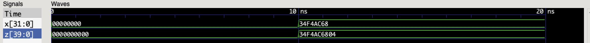

That is to say that the checksum of `x` is `04` appended at the end of `z`.

#### Combinatorial processes that cannot become combinatorial circuits.

In the final hardware, a circuit whose output signals are also used as inputs is **not** a combinatorial circuit, and may not be a viable circuit at all. Such non-combinatorial circuits are used for making memory points (e.g., registers), or local synchronization (e.g., C elements). It is possible to describe such an element with a combinatorial process: it is enough to make a signal dependent on itself in a process. For example, for both combinatorial processes, signals `x` and `u` depend on themselves, and are therefore not describing combinatorial circuit:

```ruby
par do
   x <= x + 1
end

seq do
  u <= v + 1
  v <= u + w
end
```

> __WARNING__: while such processes are accepted in HDLRuby (as well as in other hardware description languages like Verilog HDL), it is strongly recommended **not** to use them because the behavior of the resulting circuit is hard to predict. If you want to use memory elements, you should use the clocked processes instead.


### 5.4. What are the clocked processes?

These processes are declared with the `par` or `seq` keyword with a list of signal edges as an activation condition. There are two kinds of signal edges:

 * The positive edges indicate changes in single-bit signals from 0 to 1. They are noted as follows: `sig.posedge` where `sig` is a single-bit signal.

 * The negative edges indicate changes in single-bit signals from 1 to 0. They are noted as follows: `sig.negedge` where `sig` is a single-bit signal.

These processes are usually used for describing parts of circuits that are synchronized by a global clock. This includes the cases where you want to memorize a value.

Here is a simple example for illustrating this kind of process:

```ruby
system :clock_counter do
   input :clk, :run
   [32].output :count

   par(clk.posedge) do
       hif(run) { count <= count + 1 }
       helse    { count <= 0 }
   end
end

system :clock_counter_sim do
   inner :clk, :run
   [32].inner :count

   clock_counter(:clock_counterI).(clk,run,count)

   timed do
      clk <= 0
      run <= 0
      !10.ns
      clk <= 1
      !10.ns
      run <= 1
      repeat(30) { clk <= ~clk ; !10.ns }
   end
end
```

The result should be:

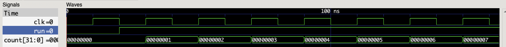

Did you get what the `clock_counter` circuit does? Yes, it simply counts the number of the positive edge of the signal `clk` when `run` is 1: signal `count` is initialized at 0 when declared, then the process which is activated on each positive edge of `clk` increases this signal by one. If you remember the sequencers, these clocked processes should look somewhat similar. Indeed, sequencers are built upon such processes. However, within processes, the fancy control statements like `sif`, `sloop`, or the enumerators **cannot** be used.

As seen in this code, a previously seen control statement has been used: the `hif`. Yes, this statement was used for parallel computation in sequencers... But more generally, are there any other control statements that can be used in processes?

### 5.5. What about the control statements in processes?

There is not much to say in this section... Because all have been said in the section about [parallelism in sequencer](#parallelism). The fact is all the constructs described in this previous section were initially designed for the processes, and by extension could also be used in sequencers.

These statements can be used for both clocked processes and combinatorial processes. For example, the following is a combinatorial circuit that implements a simple ALU (Arithmetic and Logic Unit), able to perform the addition, the subtraction, the bitwise AND, and the bitwise OR of the two input values, while the operation is selected by a third input signal.

```ruby
system :alu do
   [8].input :x,:y
   [2].input :opr
   [8].output :z

   par do
      hcase(opr)
      hwhen(0) { z <= x + y }
      hwhen(1) { z <= x - y }
      hwhen(2) { z <= x & y }
      hwhen(3) { z <= x | y }
   end
end
```

This circuit is combinatorial, hence every time `x`, `y`, or `opr` change value, `z` will also instantaneously change (in reality, there is a small physical delay that is not simulated).

You can check it as follows:

```ruby
system :alu_sim do
   [8].inner :x, :y
   [2].inner :opr
   [8].inner :z

   alu(:aluI).(x,y,opr,z)

   timed do
      x <= _h2A
      y <= _h31
      opr <= 0
      !10.ns
      opr <= 1
      !10.ns
      opr <= 2
      !10.ns
      opr <= 3
      !10.ns
   end
end
```

The result should be:

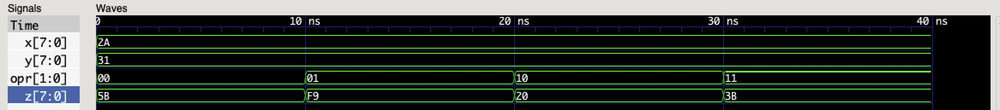

...So we can do controls with processes, but what about sharing signals?


### 5.6. How to share signals in processes?

This was the last feature of the sequencer: signals that can be written to by multiple sequencers. But can we do the same with processes?

 - The short answer is no: the shared signals and the arbiter or monitor constructs can only be used in sequencers.

 - The long answer is yes, there are even two possible ways, but you will have to describe the underlying hardware from scratch.


#### 5.6.1. The first way: use a multiplexer.

A multiplexer is a circuit that selects one input among several ones to be output. Usually, this is done according to an additional input that indicates the number of the selected input. In HDLRuby, there are two simple ways to describe multiplexers:

 - The use of the `hcase` statements. We had an example previously with the ALU: 
    
    ```ruby
    system :alu do
       [8].input :x,:y
       [2].input :opr
       [8].output :z
    
       par do
          hcase(opr)
          hwhen(0) { z <= x + y }
          hwhen(1) { z <= x - y }
          hwhen(2) { z <= x & y }
          hwhen(3) { z <= x | y }
       end
    end
    ```  
  
    With this example, all the operations are performed in parallel, and the `hcase` statement selects which result is to be sent to `z` according to the selection signal `opr`.

  - The use of the `mux` operator that has the following syntax: `mux(<selection>,<input 0>,<input 1>, ...)` where `selection` is the selection signal, and the other arguments are the possible inputs. The same ALU circuit can therefore be described as follows:

    ```ruby
    system :alu do
       [8].input :x,:y
       [2].input :opr
       [8].output :z
    
       z <= mux(opr, x+y, x-y, x & y, x | y)
    end
    ```  
 
    A connection is used instead of a combinatorial process for this second example since there is a single statement.


#### 5.6.2. The second way: use of tri-state bus <a name="tri-state"></a>

Multiplexers are easy to describe and use, but their size grows exponentially with the number of inputs and linearly with their bit width. Moreover, the number of inputs of a chip is often strongly limited. For all these reasons, an alternative is sometimes used: the tri-state buses. They are signals where several processes or circuits can write a value provided that only one does it at a time and that when not writing the accesses are set in high impedance.

> Before explaining further the tri-state buses, we need to clarify a possible misconception about hardware values: we often spoke about bits, and you may have assumed that their possible values were 0 or 1 for standard boolean logic. However, in hardware design it is common to use a 4-valued logic that represents the relevant states of a wire in a circuit:

 - `0` for ground level, used for representing `false` or the digit `0`;

 - `1` for power supply level, used for representing `true` or the digit `1`;

 - `Z` for high impedance, used in tri-state buses;

 - `X` for undefined level, usually indicating a problem in the circuit or an uninitialized state.

Physically, when a signal is set to the `Z` state, it is possible to safely write another value on it, its state becoming this written value. Such a signal is then called a tri-state signal or bus.

Tri-state signals can be `inner` or `inout`, and as long as there are no simultaneous `0` or `1` writes on them, they can be used freely... In theory. However, in practice, synthesis tools prioritize safety over flexibility and will reject several descriptions that should work. This is highly dependent on the tool you are using, hence we cannot give precise guidelines for the proper use of such signals. Instead, here is an example of tri-state bus usage that should work with a majority of the design tools, please feel free to adapt it to your needs:

```ruby
system :ram8 do
    input :clk, :en, :rwb
    [8].input :addr
    [8].inout :data

    bit[8][-2**8].inner :content

    [8].inner :tmp

    par do
       hif(en & rwb) { data <= tmp }
       helse         { data <= _bZZZZZZZZ }
    end

    par(clk.posedge) do
        hif(en) do
            # Read case
            hif(rwb)   { tmp <= content[addr] }
            helse      { content[addr] <= data }
        end
    end
end

system :ram8_sim do
    inner :clk, :en, :rwb
    [8].inner :addr, :data

    [8].inner :value

    ram8(:ram8I).(clk,en,rwb,addr,data)

    par do
       hif(en & ~rwb) { data <= value }
       helse          { data <= _bZZZZZZZZ }
    end

    timed do
        addr  <= 0
        en    <= 0
        rwb   <= 1
        value <= 0
        clk   <= 0
        !10.ns
        clk   <= 1
        !10.ns
        repeat(256) do
            en  <= 1
            rwb <= 1
            clk <= 0
            !10.ns
            clk   <= 1
            !10.ns
            en    <= 0
            addr  <= addr + 1
            value <= value + 1
            clk   <= 0
            !10.ns
            clk   <= 1
            !10.ns
            en  <= 1
            rwb <= 0
            clk <= 0
            !10.ns
            clk <= 1
            !10.ns
            en <= 0
            clk <= 0
            !10.ns
            clk <= 1
            !10.ns
        end
    end
end
```

And the simulation result should be:

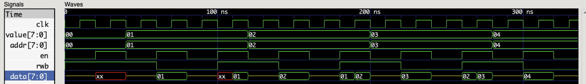

The first module is an 8-bit address 8-bit data RAM with a single data bus for both reading and writing. When the RAM is not read (`en` is 0 or `rwb` is 0), the data bus is set to `Z`. The second module simply accesses the RAM, and for that purpose uses a process specifically for writing to the data bus: when a write operation is performed (`en` is 1 for activating the access to the RAM and `rwb` is set to 0), the value is written to the bus, otherwise, a value is nonetheless written but it is a `Z` value. The coding style of this process is crucial for ensuring synthesis tools will succeed: we cannot guarantee it will work if it is described differently.


#### This section may have been quite a leap from the software mindset...

---

But, now you may understand:

 * How to describe low-level hardware with HDLRuby with processes.

 * The existence of three kinds of processes: the connections, combinatorial, and clocked processes.

 * How to use controls in processes.

 * How to write several values to a single signal without the comfort brought by the sequencers and their shared signals.

 * What is a tri-state bus and how to use it.

With that, you have all the constructs required for describing optimized hardware. Of course, mastering them requires a lot of know-how, but this is out of the scope of this tutorial. To go further, please follow lessons about hardware design using popular hardware description languages like Verilog HDL or VHDL since what you can do with them, you can do it with HDLRuby.

However, there remains a few major features for more efficient coding inherited from the Ruby language.


## 6. Not enough? What about genericity, object orientation, metaprogramming, and reflection?

Let us imagine you spent hours designing a circuit processing 8-bit values for outputting a 16-bit result and you learn that the input should be 16-bit and the output 8-bit. Well, that's not so tough, you just need to modify the data types in your circuit description... **everywhere**. When you just finished, you learn that it would be great if there was also another version of the circuit that could output flags about the result. Ok, so let us make another version of the circuit, and since it is not so different, let us do some copy and paste, and then make modifications for the flags... But whoop! You did not notice that with your modifications you unintentionally modified a few lines of code introducing new bugs... And of course, you realize it after hours of testing.

Such situations happen all the time in software design... But it is much worse in hardware. Indeed, due to the variety of hardware circuits, it is very common to want to reuse a design with different bit widths. This is why, existing hardware description language support genericity to a certain degree. However, HDLRuby ruby goes further in term of genericity, and also add object-oriented programming, metaprogramming, and reflection concepts to maximize the possibilities of code reuse. From now on, let us detail:

 * [Genericity in HDLRuby](#61-genericity-in-hdlruby)

 * [Object-oriented programming in HDLRuby](#62-object-oriented-programming-in-hdlruby)

 * [Metaprogramming and reflection in HDLRuby](#63-metaprogramming-and-reflection-in-hdlruby)

### 6.1. Genericity in HDLRuby

In HDLRuby, genericity is supported through the *generic module* constructs. These constructs describe circuits like standard module does, but with the addition of parameters that control their content. They are declared as follows:

```ruby
system :<name> do |<list of parameters>|
   <some hardware description code>
end
```

The list of parameters is simply a list of variable names that can represent anything, e.g., some values of any type, some data types, or even some chunks of Ruby or HDLRuby code. 

Before being used, a generic module must be specialized by specifying each of its parameters. This is done as follows:

```ruby
<generic system>(<list of objects>)
```

Where `generic system` is the name of the generic module to specialize.

And there is nothing more to explain since there is no restriction with the parameters. Instead, here are a couple of examples. First, a module counting the clock cycles whose counter bit width is a generic parameter:

```ruby
system :counter do |size|
   input :clk, :rst
   [size].output :count

   par(clk.posedge) do
      hif(rst) { count <= 0 }
      helse    { count <= count + 1 }
   end
end
```

If you want to instantiate this circuit, you will need first to specialize it. For example, here are two instances, named `counterI8` and `counterI16` that have respectively a 8-bit and a 16-bit output:

```ruby
counter(8).(:counterI8)
counter(16).(:counterI16)
```

The second example is again a counter of clock cycles but whose full data type of the output is a generic parameter (not only its size), and which has a given value that when reached triggers some hardware code also provided as a generic parameter:

```ruby
system :counter_ext do |typ,trig,code|
   input :clk, :rst
   typ.output :count

   seq(clk.posedge) do
      hif(rst) { count <= 0 }
      helse do
         count <= count + 1
         hif(count == trig) { code.call(count) }
      end
   end
end
```

There is more to unwrap here:

 * `typ` is the data type of the output, and is therefore used as is for declaring `count`

 * `trig` is the value that will activate the hardware provided as a generic parameter.

 * `code` is a chunk of HDLRuby code. To paste this code chunk, the `call` method is used, and for giving access to the `count` signal to this code chunk, it is passed as an argument of the method.

And here is one instance of this module called `counter_extI`, with a 16-bit signed output, a trigger at value 5, and a triggered code that sets the count to -4:

```ruby
system :counter_ext_sim do
   inner :clk,:rst
   signed[16].inner :count
   counter_ext(signed[16],5, proc { |count| count <= -4 }).(:counter_extI).(clk,rst,count)

   timed do
      clk <= 0
      rst <= 0
      !10.ns
      clk <= 1
      !10.ns
      clk <= 0
      rst <= 1
      !10.ns
      clk <= 1
      !10.ns
      clk <= 0
      rst <= 0
      repeat(20) { !10.ns; clk <= ~clk }
      !10.ns
   end
end
```

In this code, the syntax `proc <block>` is for creating a chunk of HDLRuby (or Ruby) code from the content of `block`. With this environment, the simulation result should be:

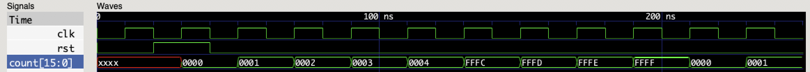
 

### 6.2. Object-oriented programming in HDLRuby

Genericity allows using a single design for several different circuits but it does not allow modifying this design. This possibility is brought by object-oriented programming and its key concept: [inheritance](#621-inheritance). With it, it is possible to modify afterward a circuit design without touching the original description, to define a new circuit based on an original one without redoing everything from scratch, and to change a single instance of a circuit without influencing the other ones, all that with a simple [construct](#622-modifying-a-module-or-an-instance). Finally, it is possible under certain conditions to [reimplement parts of the code](#623-overriding).


#### 6.2.1 Inheritance

In HDLRuby, inheritance can be applied to modules. When a module inherits from another one, the latter is called its *superclass module*. By default, a module contains all the ports and all the content of its superclass modules. Then, new ports or content can be added to the later at will. Inheritance is declared as follows:

```ruby
system :<name>, <list of superclass modules> <block>
```

Alternatively, the following syntax is also possible:

```ruby
system :<name> do
   include <list of superclass modules>
   <HDLRuby code>
end
```

For example, let us consider the following 8-bit adder/subtracter module:

```ruby
system :addsub8 do
   input :s
   signed[8].input :x, :y
   signed[8].output :z

   par do
      hif(s) { z <= x - y }
      helse  { z <= x + y }
   end
end
```

And let us assume we want to design a new 8-bit adder/subtracter module that also outputs a zero flag. That can be done with inheritance as follows:

```ruby
system :addsub_zf8, addsub8 do
   output :zf

   zf <= (z == 0)
end
```

So why is there an alternate syntax with the `include` keyword? This is for easing the mix of genericity and inheritance. For example, the previous circuit was 8-bit only. What if you want to do the same with generic input and output widths? For the initial counter, this is straightforward:

```ruby
system :addsub do |width|
   inner :s
   [width].input :x, :y
   [width].output :z

   par do
      hif(s) { z <= x - y }
      helse  { z <= x + y }
   end
end
```

But for the second one? It needs to transmit its generic parameter to its superclass module, but the parameter is only available within its block description. In such a case, the second syntax is useful:

```ruby
system :addsub_zf do |width|
   include addsub(width)
   output :zf

   zf <= (z == 0)
end
```

#### 6.2.2. Modifying a module or an instance

Let us assume that you think that after all, the adder-subtracter circuit you described previously should definitively have a `zf` flag for your new project. You can of course create a new module with inheritance for that, but you can also modify afterward the initial `addsub` module using the `open` method as follows:

```ruby
addsub.open do
   output :zf

   zf <= (z == 0)
end
```

After that, all the instances that are created from `addsub` will include the `zf` flag computation and output.

In contrast, you may want that only one instance has the flag. In such a case, it may not be necessary to define a new module for that but just modify this instance only. This is possible using again the `open` method but on the instance. For example with the instance used in the following simulation environment:

```ruby
system :addsub_sim do
   signed[8].inner :x, :y, :z
   inner :zf, :s

   addsub(signed[8]).(:addsubI8).(s,x,y,z)

   addsubI8.open do
      output :zf
   
      zf <= (z == 0)
   end

   zf <= addsubI8.zf

   timed do
      x <= 0
      y <= 0
      s <= 0
      repeat(3) { !10.ns; x <= x + 1 }
      repeat(3) { !10.ns; y <= y + 1 }
      s <= 1
      repeat(3) { !10.ns; x <= x - 1 }
      repeat(3) { !10.ns; y <= y - 1 }
      !10.ns
   end
end
```

And the simulation result should be:

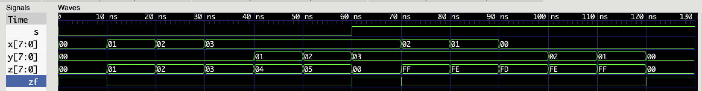

#### 6.2.3. Overriding

Let us consider the following circuit that performs an addition a computes four flags:

```ruby
system :adder_flags do |width|
   signed[width].input :x, :y
   signed[width].output :z
   output :cf, :zf, :sf, :of

   [cf,z] <= x.as(signed[width+1]) + y

   zf <= (z == 0)
   sf <= z[-1]
   of <= (x[-1] & y[-1] & ~z[-1]) | (~x[-1] & ~y[-1] & z[-1])
end
```

And let us assume we want to make a circuit that does the same but saturates the addition result between -300 and +300. For that purpose, the computation of `z` must be replaced. This is called `overriding` and for sake of code readability overriding is only permitted for *named sub-sections* of a module. A named subsection is declared as follows:

```ruby
sub(:<name>) <block>
```

Where `block` can contain any HDLRuby code apart from the port definition. A named subsection can be overridden anywhere in the code, and also in subclass modules by redefining it. In our previous example, if `adder_flags` is rewritten as follows:

```ruby
system :adder_flags do |width|
   signed[width].input :x, :y
   signed[width].output :z
   output :cf, :zf, :sf, :of

   sub(:add) do
      [cf,z] <= x.as(signed[width+1]) + y
   end

   zf <= (z == 0)
   sf <= z[-1]
   of <= (x[-1] & y[-1] & ~z[-1]) | (~x[-1] & ~y[-1] & z[-1])
end
```

Then a new module with saturated addition can be defined as follows using inheritance and overriding:

```ruby
system :adder_sat_flags do |width|
   include adder_flags(width)

   sub(:add) do
      seq do
         [cf,z] <= x.as(signed[width+1]) + y
         hif(z<-300) { z <= -300 }
         hif(z>300)  { z <= 300 }
      end
   end
end
```

If you wish to see how this adder with saturation works, here is a simple simulation environment for it:

```ruby
system :adder_sat_flags_sim do
   signed[16].inner :x, :y, :z
   inner :cf, :zf, :sf, :of

   adder_sat_flags(16).(:adderI).(x,y,z,cf,zf,sf,of)

   timed do
      x <= 0
      y <= 0
      repeat(3) { !10.ns; x <= x + 1 }
      repeat(3) { !10.ns; y <= y + 1 }
      !10.ns
      x <= 299
      y <= 0
      repeat(3) { !10.ns; x <= x + 1 }
      !10.ns
      x <= -1
      y <= -300
      repeat(3) { !10.ns; x <= x + 1 }
      !10.ns
   end
end
```

And the simulation result should be:

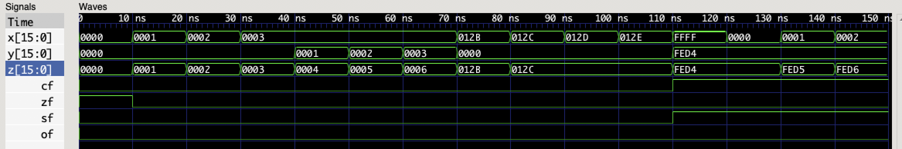

__Note__: with this circuit, the `of` flag (overflow) is always 0 because there cannot be any overflow for a 10-bit number with saturation at -300, 300.


### 6.3. Metaprogramming and reflection in HDLRuby

There is not much to say about metaprogramming and reflection because both have been used extensively in this tutorial.

 * Metaprogramming consists in using programs that generate the final code. In HDLRuby, this is done by using Ruby code for generating, passing as an argument, and appending chunks of HDLRuby code. This has been done when presenting how to describe parallel code in sequencers, but this can be used everywhere, e.g., within the process too. Moreover, the possibility to use a chunk of code as a generic argument presented in this section is also metaprogramming.

 * Reflection has been used in several cases, e.g., the `width` method for knowing the bit width of a type or the `open` method. For generally, HDLRuby provides a large number of methods for inspecting and modifying directly the objects of the internal representation. Please consult the documentation of the HDLRuby classes for details about them (good luck, this is low-level coding documentation).

> __Note__: the sequencers, the shared signals, the arbiter, and the monitor are not native HDLRuby constructs, they have all been implemented with metaprogramming and reflection.


## 7. What next?

There are still many aspects of HDLRuby that have not been addressed in this tutorial. For example, finite state machines (FSM) and decoders are crucial hardware components that you should learn about, and which HDLRuby provides specific constructs for easier design. So from now on, please consult the main documentation of HDLRuby, and have a look at the code samples provided in the HDLRuby distribution. They can be copied to your working directory using the following command:

```bash
hdrcc --get-samples
```
